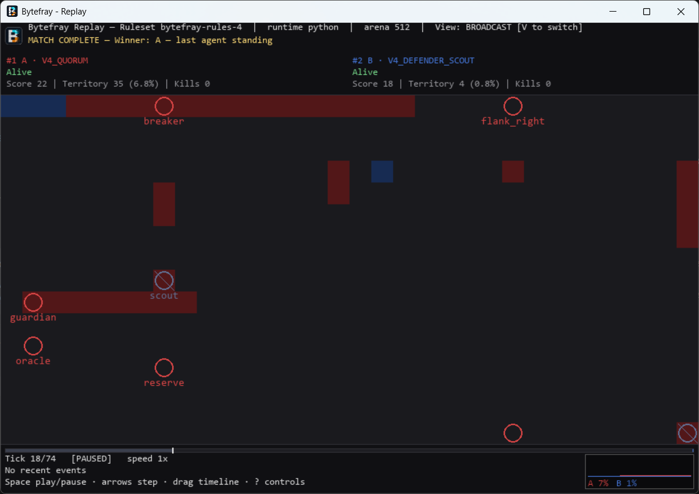

# Bytefray

<p align="center">
  
</p>

Bytefray is a deterministic shared-memory programming game where Python agents compete for control of a circular arena.

Bytefray takes inspiration from Core War's shared-memory competitive programming model but is not a Redcode implementation or compatibility layer. It replaces vintage virtual machine architectures with a modern Python execution environment, structured agent APIs, full-match replay recording, and graphical tooling. Matches execute discrete ticks where agents maneuver processes, inspect and rewrite memory cells, defend their assigned cores, and attempt to eliminate opponents.

[](pyproject.toml)
[](LICENSE)

## Technical Snapshot

| Dimension | Specification |
|---|---|
| **Runtime** | Python 3.10–3.14 (CPython; qualified on Windows AMD64 and Linux x86_64) |
| **Dependencies** | PyYAML for core engine; optional `pygame-ce` (replays) and `PySide6` (designer) |
| **Arena Model** | Circular array of discrete memory cells (default 4096); 1-byte value (`0..255`) + last-writer ownership |
| **Simulation** | Discrete-tick deterministic engine; chunked quota scheduling (`K = 2`, `Q = 8`) |
| **Stable Ruleset** | `bytefray-rules-4` (spatial multi-process, seed-derived core placement, round-robin process selection) |
| **Agent API** | Agent API v2 (`reset`, `declare_processes`, `act`) |
| **Action Vocabulary** | `READ` (absolute address), `WRITE` (absolute address), `MOVE` (relative delta `[-64, 64]`) |
| **Elimination Condition** | Core capture: an entrant is eliminated when it owns 0 cells of its 8-cell core at tick end |
| **Artifact Formats** | `battle2.result` (schema v1 JSON), `battle2.replay` (schema v4 JSONL) |
| **Execution Model** | Local trusted Python execution; worker subprocesses with per-call timeouts for hang containment |
| **Tooling** | Headless CLI, interactive Pygame replay visualizer, PySide6 visual Agent Designer |

<p align="center">
  
</p>
<p align="center"><em>Interactive replay viewer displaying a multi-process match under <code>bytefray-rules-4</code>, showing process anchors, reach zones, arena memory, territory distribution, and playback timeline.</em></p>

---

## Quick Start

### 1. Installation

Bytefray requires Python 3.10–3.14. Install the package in a virtual environment:

```bash
# Create and activate a virtual environment
python -m venv .venv
# Windows PowerShell: .\.venv\Scripts\Activate.ps1
# Linux (bash/sh):    source .venv/bin/activate

# Install the core engine CLI (requires only PyYAML)
python -m pip install bytefray

# Or install with graphical replay and designer tools
python -m pip install "bytefray[replay,designer]"
```

For local repository development, install editable with development extras:

```bash
python -m pip install -e ".[dev,replay,designer]"
```

> **Platform Notes**:
> * **Windows AMD64**: A standalone administrative installer (`Bytefray-Setup-*.exe`) is available on the [Releases](https://github.com/libertaine/Bytefray/releases) page, packaging the CLI, Agent Designer, and Replay Viewer into `C:\Program Files\Bytefray\bin`.
> * **Linux**: Headless operation requires no GUI libraries. See [docs/LINUX_INSTALL.md](docs/LINUX_INSTALL.md) for X11/Xvfb graphical setup.
> * **macOS**: macOS is not an officially tested or supported platform.

### 2. Run an Existing Match

Discovered starter agents are available immediately:

```bash
# List available starter agents
bytefray agents

# Run a match between two starter agents and record a replay
bytefray run --a-type v5_region_attacker --b-type v5_core_defender --seed 42 --ticks 200 --replay runs/demo/replay.jsonl
```

### 3. Inspect the Replay

Replays decouple simulation from visualization. Play back recorded execution in the terminal or with the interactive Pygame visualizer:

```bash
# Headless terminal playback
bytefray replay --replay runs/demo/replay.jsonl --renderer headless

# Interactive Pygame visualizer (requires 'replay' extra)
bytefray replay --replay runs/demo/replay.jsonl --renderer pygame
```

### 4. Create Your First Agent

An Agent API v2 agent implements a factory returning an object with three methods: `reset`, `declare_processes`, and `act`.

Scaffold a new agent using the CLI:

```bash
bytefray agents create my_agent --api-version 2 --template blank
```

This writes an `agent.yaml` manifest and an `agent.py` starter into your writable agents catalog:

```python
"""Starting point for a Bytefray Agent API v2 process agent."""

from battle_engine.agent_api import (
    ActionKindV2,
    AgentAction,
    MatchContextV2,
    ObservationV2,
    ProcessDeclaration,
)


class Agent:
    def reset(self, context: MatchContextV2) -> None:
        """Called once before tick 0. Store match context and seeded RNG."""
        self.rng = context.rng
        self.signature = 0xA5

    def declare_processes(self) -> list[ProcessDeclaration]:
        """Declare processes and divide your per-tick action quota (shares must sum to 1.0)."""
        return [ProcessDeclaration(id="main", reach=1, share=1.0)]

    def act(self, observation: ObservationV2) -> AgentAction:
        """Called for each allocated action slot. Returns READ, WRITE, or MOVE."""
        return AgentAction(
            kind=ActionKindV2.WRITE,
            operand=observation.self_anchor,
            value=self.signature,
        )


def create_agent() -> Agent:
    return Agent()
```

### 5. Run Your Custom Agent

Execute a match with your new agent against any reference opponent:

```bash
bytefray run --a-type my_agent --b-type v5_region_attacker --seed 42 --ticks 200
```

### 6. Validate and Test

Use Agent Lab commands to verify lifecycle compliance and test against opponents with hang containment:

```bash
# Dry-run validation (verifies factory, reset, process declaration, and one act call)
bytefray agents validate my_agent

# Run a supervised development match with timeout protection
bytefray agents test my_agent --opponent v5_region_attacker
```

---

## How Bytefray Works

### Arena and Memory Ownership
The arena is a circular array of discrete memory cells (default 4096 cells, wrapping at `arena_size`). Each cell stores an 8-bit integer value (`0..255`) and the identity of the entrant that wrote to it most recently. Unwritten cells have no owner.

### Cores and Elimination
Every entrant is assigned a contiguous 8-cell core (`CORE_SIZE = 8`). In the stable ruleset, core locations are derived deterministically from the match seed with a guaranteed minimum circular separation (64 cells) between entrants.

* **Victory Condition**: An entrant is eliminated when it owns **zero of the eight cells** of its assigned core.
* Elimination checks occur once per tick, after all actions for that tick have executed. Holding even a single core cell keeps the entrant alive.
* If multiple entrants remain alive when the tick limit is reached, winner resolution evaluates accumulated scores based on survival time, core kills, and territorial ownership.

### Spatial Multi-Process Execution
In Ruleset v4, entrants act through one or more *processes*. Each process has:
* An **anchor**: Its current address in the circular arena. All processes begin co-located at their entrant's core base.
* A **reach**: A circular radius around the anchor within which the process can read and write.
* A **quota share**: The proportion of the entrant's per-tick action budget allocated to this process.

Declaring additional processes provides spatial positioning and specialized roles, not additional actions: every entrant shares a fixed budget of `Q = 8` actions per tick regardless of process count.

### Fundamental Game Loop

Each simulation tick resolves through five deterministic phases:

```
[Interleaved Quota Scheduling]
           │
           ▼
[Round-Robin Process Selection]
           │
           ▼
 [Observation Generation] ──► [Agent Decision: act()]
           │
           ▼
[Deterministic Action Resolution & Disruption]
           │
           ▼
[Core Capture Check, Scoring, & Replay Snapshot]
```

1. **Entrant Scheduling**: Entrants take turns in chunked action slots (`K = 2` actions per slice) rotating starting seat order across ticks to eliminate first-player bias.
2. **Process Selection**: Within an entrant's turn, action slots rotate across its eligible processes via round-robin selection. If a process was disrupted earlier in the tick, its remaining share redistributes evenly among remaining eligible processes.
3. **Observation**: The engine supplies the active process with an immutable `ObservationV2`. Visibility is spatial: an agent sees enemy process anchors that fall within the reach of *any* eligible friendly process. Opponent core locations, process configurations, and strategy states are never revealed.
4. **Action Execution**: The process returns one of three actions:
   * **`WRITE(address, value)`**: Writes `value & 0xFF` to an absolute address within the process's reach and claims ownership. If the address matches an enemy process's anchor, all enemy processes on that cell are disrupted for the remainder of the tick (`D = 1`).
   * **`READ(address)`**: Reads the byte value and last-writer entrant ID at an absolute address within reach, reported in the process's subsequent observation.
   * **`MOVE(delta)`**: Adjusts the process's anchor by a signed relative displacement, clamped to `[-64, 64]` and wrapped circularly.
   * *Rejection*: Actions targeting addresses beyond a process's declared reach are discarded; the action slot is consumed without effect.
5. **Tick Resolution & Telemetry**: Core ownership is audited for eliminations. Territory and survival scores accrue, and state diffs are appended to the canonical `replay.jsonl` stream.

---

## Writing an Agent

### Agent API v2 Interface

Agents target the `AgentV2` protocol defined in `battle_engine.agent_api`:

```python
class AgentV2(Protocol):
    def reset(self, context: MatchContextV2) -> None: ...
    def declare_processes(self) -> list[ProcessDeclaration]: ...
    def act(self, observation: ObservationV2) -> AgentAction: ...
```

* **`reset(context: MatchContextV2)`**: Runs once before tick 0. Provides `context.arena_size`, `context.tick_limit`, `context.agent_id` (slot `"A"`, `"B"`, etc.), `context.parameters`, and `context.rng`.
* **`declare_processes() -> list[ProcessDeclaration]`**: Runs once after `reset`. Returns a list of `ProcessDeclaration(id="...", reach=..., share=...)`. Shares must be non-negative and sum to `1.0`.
* **`act(observation: ObservationV2) -> AgentAction`**: Invoked for each action allocated to the acting process. Returns an `AgentAction(kind=ActionKindV2.*, operand=..., value=...)`.

### Observation Model

Every call to `act` receives an immutable `ObservationV2`:

| Category | Attributes | Description |
|---|---|---|
| **Identity & Position** | `self_process_id`, `self_anchor`, `self_reach` | ID, current arena address, and reach radius of the acting process |
| **Friendly Core** | `own_core_base`, `own_core_size` | Starting address and cell length (`8`) of your own core |
| **Perception** | `visible_enemy_anchor_addresses` | Sorted tuple of enemy process anchors currently within reach of any friendly process |
| **Feedback** | `previous_action_applied`, `previous_read_value`, `previous_read_owner` | Outcome and read payload from this process's preceding action |
| **Timing** | `current_tick`, `last_callback_tick`, `previous_action_tick` | Tick indices for temporal tracking and disruption inference |

### Parameters and Presets

Agents can declare typed parameter schemas in `agent.yaml`. Values are validated at match configuration time and passed to `reset` via `context.parameters`:

```yaml
kind: python
api_version: 2
entrypoint: agent.py:create_agent
version: "1.0.0"

parameters:
  attacker_reach:
    type: int
    default: 16
    min: 4
    max: 64

presets:
  far_sighted:
    attacker_reach: 32
```

Parameters follow precedence: `schema defaults < preset < CLI/GUI overrides`. Overrides are passed at the command line via `--a-preset` and `--a-param`:

```bash
bytefray run --a-type v5_region_attacker --b-type v5_core_defender --a-preset far_sighted --a-param attacker_reach=24
```

See [docs/AGENT_API_V2.md](docs/AGENT_API_V2.md) for the complete authoring specification and [docs/V5_STARTER_AGENTS.md](docs/V5_STARTER_AGENTS.md) for strategy patterns.

---

## Determinism and Reproducibility

A match is driven by an explicit seed and deterministic engine rules. Agents that use Bytefray's provided RNG and obey the deterministic-agent contract can reproduce simulations for testing, replay, tournament evaluation, and automated experimentation.

### Concrete Guarantees and Limits

* **Same-Environment Byte-Identical Artifacts**: Given the same match seed, ruleset identity, entrant configurations, parameters, and arena dimensions, repeated executions on the same environment produce identical match outcomes, identical event timelines, and byte-identical `replay.jsonl` and `result.json` records.
* **Cross-Platform Semantic Equivalence**: Simulation state transitions, scheduling, seeded core placement (`seeded_seat_starts`), and winner resolution rely on discrete integer arithmetic. Continuous integration validates deterministic regression vectors across Windows AMD64 and Linux x86_64, and across Python 3.10 through 3.14.
* **Deterministic Trace Identity**: Diagnostic traces (`trace.jsonl`) generated during supervised test runs capture identical decision sequences across runs with matching seeds.

### The Deterministic Agent Contract

Bytefray's engine guarantees determinism **if and only if** agent implementations adhere to the following constraints:

1. **Use `context.rng`**: Use only the seeded `random.Random` instance provided in `MatchContextV2`. Never import or call unseeded global generators (`random.random()`, `numpy.random`).
2. **No Wall-Clock Time**: Do not branch on `time.time()`, `time.perf_counter()`, or datetime values.
3. **No External I/O**: Do not perform filesystem access, network requests, subprocess execution, or IPC during `reset`, `declare_processes`, or `act`.
4. **No Address/Memory Hashing**: Avoid iterating over sets or dictionaries keyed by object memory addresses (`id()`) or types whose hash randomized across Python processes (`PYTHONHASHSEED`).
5. **No Shared Mutable State**: Do not store state in class variables or module-level globals that persist across multiple match invocations.

Bytefray does not enforce sandboxing or runtime restrictions to prevent nondeterministic code; agents that violate these boundaries will produce diverging simulations that cannot be reproduced.

---

## Replays and Tooling

Bytefray includes a modular tool suite separating headless simulation from presentation:

### 1. Command-Line Interface (`bytefray`)
* `bytefray run`: Execute native matches or pMARS ICWS'94 benchmarks.
* `bytefray replay`: Play back recorded `.jsonl` replays via headless terminal or Pygame.
* `bytefray tournament`: Run or resume headless round-robin tournaments across rosters.
* `bytefray design`: Launch the PySide6 visual Agent Designer.
* `bytefray agents`: Comprehensive agent lifecycle tools:
  * `create`: Scaffold blank or annotated starter templates (`--api-version 2`).
  * `validate`: Dry-run agent lifecycle with timeout protection.
  * `test`: Execute short development matches against reference opponents.
  * `inspect`: Inspect observation and action decisions from `trace.jsonl`.
  * `diverge`: Compare two traces to identify the exact tick where decisions differed.
  * `evaluate`: Run pairwise or group evaluation matrices across seeds.

### 2. Pygame Replay Viewer
Launched via `bytefray replay --renderer pygame <path>` or `bytefray-replay-viewer`. Features:
* Broadcast and perspective viewing modes.
* Visual process anchors, reach perimeters, and disruption indicators.
* Memory ownership overlays with territory tracking bars.
* Interactive playback controls: scrub timeline, step tick-by-tick, adjust speed.

### 3. PySide6 Agent Designer
Launched via `bytefray design` or `bytefray-agent-designer`. Features:
* Match setup with agent selection, seed controls, and ruleset pickers.
* Dynamic parameter controls generated from agent YAML schemas.
* Built-in code inspection, validation, test launcher, and replay browser.

---

## Bytefray vs. Core War

Bytefray takes inspiration from Core War's shared-memory competitive programming model but is not a Redcode implementation or compatibility layer.

| Dimension | Core War (ICWS'94 / Redcode) | Bytefray (Ruleset v4 / Agent API v2) |
|---|---|---|
| **Warrior Code** | Redcode assembly text executed instruction-by-instruction | Standard Python classes implementing structured lifecycle methods (`reset`, `declare_processes`, `act`) |
| **Arena Memory** | Circular array of Redcode instructions (`opcode`, addressing modes, A/B fields) | Circular array of discrete memory cells storing byte values (`0..255`) and last-writer ownership |
| **Execution Model** | Instruction pointer step; warriors mutate memory into executable code or bombs | Discrete ticks; per-entrant action quotas (`Q = 8`) distributed to processes via round-robin scheduling |
| **Multi-Process Model** | Dynamic process splitting via the `SPL` instruction | Process declarations (`ProcessDeclaration`); fixed per-entrant quota shared across all processes |
| **Combat & Victory** | Elimination occurs when a process thread executes an illegal instruction (e.g. `DAT`) | Core defense: an entrant is eliminated when it owns zero cells of its 8-cell arena core |
| **Interference Mechanic** | Corrupting opponent instruction code in memory | Disruptive writes: a `WRITE` hitting an enemy process anchor disrupts that process for the tick (`D = 1`) |
| **Sensing & Perception** | Warriors cannot inspect memory without reading cells via `CMP` / `SLT` | Structured spatial observation (`ObservationV2`) providing anchor, reach, core base, and visible enemy anchors |
| **Randomness & Placement** | Starting placement randomized in core; no runtime RNG | Seed-derived core placement (`seeded_seat_starts`); per-entrant seeded RNG (`context.rng`) |
| **Tooling & Ecosystem** | Vintage terminal simulators and pMARS binaries | Headless CLI, canonical JSON/JSONL replays, interactive Pygame visualizer, and PySide6 graphical designer |

---

## Execution and Trust Model

Bytefray's execution architecture distinguishes between **development reliability containment** and **security sandboxing**.

### Local Trusted Code Model
Agents are trusted local Python code executed through Bytefray's gameplay interface. Bytefray is designed for local experimentation and evaluation, not as a hardened sandbox for untrusted hostile code. Agent modules are imported dynamically and execute with the full OS permissions of the running user.

> **Security Boundary**: Bytefray does **not** provide a hardened security sandbox against hostile or untrusted code. Never execute unreviewed third-party agents from untrusted sources.

### Hang and Timeout Containment
To protect development workflows, test harnesses, and automated tournaments from broken agent code, Bytefray provides isolated process supervision:

* **Supervised Worker Subprocesses**: `bytefray agents test`, `bytefray agents validate`, and parallel evaluation cells execute Python entrants inside dedicated worker subprocesses (`AgentWorkerHandle`).
* **IPC Isolation**: Workers communicate via newline-delimited JSON over standard input and output pipes. Standard output is redirected to standard error before agent execution to prevent `print()` statements from corrupting protocol streams. Standard input is closed to prevent interactive `input()` calls from blocking.
* **Uniform Per-Call Timeouts**: Supervised calls enforce an explicit deadline (default `5.0s`, configurable via `--timeout`). If an agent blocks during load, `reset()`, or an individual `act()` call, the worker process is terminated unconditionally.
* **Actionable Diagnostics**: Timeouts and uncaught exceptions produce structured diagnostic events (`agent_action_timeout`, `agent_worker_exited`, etc.) and forfeit the match without hanging the caller.
* **Direct Execution Performance**: Standard `bytefray run` matches execute in-process by default to eliminate IPC overhead (~120 ms for a 200-tick match).

---

## Engineering Standards

Bytefray's codebase emphasizes strict reproducibility, version isolation, and architectural boundaries:

* **Explicit Seeds & Discrete Arithmetic**: All simulation logic (scheduling, movement, placement, action resolution) uses discrete integer math and explicit seeds; floating-point simulation drift is eliminated.
* **Separation of Simulation & Visualization**: The engine (`battle_engine`) executes entirely headless without GUI dependencies. Presentation tools (`battle_client`, Pygame viewer, PySide6 Designer) consume decoupled event and replay streams.
* **Typed Protocols & Immutable Data**: Agent interactions use strict dataclasses and typed protocols (`AgentV2`, `MatchContextV2`, `ObservationV2`, `AgentAction`). Observations and match contexts are immutable or read-only proxies.
* **Independent Compatibility Axes**: Release versions, Agent API versions, Ruleset identities, and artifact wire schemas are decoupled and versioned independently (see [docs/COMPATIBILITY.md](docs/COMPATIBILITY.md)). A ruleset change does not force an API or schema bump.
* **Deterministic Artifact Hashing**: Match identities (`match_id`, `result_id`, `replay_id`) derive deterministically from canonical SHA-256 hashes of agent source, configuration, and ruleset identity—independent of absolute checkout paths or filesystem timestamps.
* **Multi-Platform CI Qualification**: Continuous integration qualifies headless execution and determinism regression suites across Python 3.10, 3.11, 3.12, 3.13, and 3.14 on both Linux and Windows.

---

## Rulesets and Compatibility

Bytefray maintains independent, versioned compatibility axes across releases, rulesets, and schemas (see [docs/COMPATIBILITY.md](docs/COMPATIBILITY.md)).

### Active Gameplay Ruleset: `bytefray-rules-4`
The current permanent stable ruleset is `bytefray-rules-4`. An omitted `--ruleset` flag for Agent API v2 entrants resolves to this ruleset automatically. It defines:
* Spatial multi-process execution with round-robin process selection.
* Seed-derived core placement with minimum 64-cell circular separation.
* Fixed ruleset constants: `CORE_SIZE = 8`, `Q = 8` actions/tick, `D = 1` disruption duration, move clamp `[-64, 64]`.

### Historical Rulesets
Earlier gameplay contracts are preserved unchanged for historical replay and research validation:
* `bytefray-rules-4-alpha2`: Semantic predecessor of Ruleset v4, preserved as a research milestone.
* `bytefray-rules-4-alpha1`: Initial v4 alpha with evenly spaced core placement and priority process selection.
* `bytefray-rules-2`: Historical Agent API v1 Python ruleset with single-actor execution.
* `bytefray-rules-1`: Historical VM / pMARS Redcode ruleset.

### Scope Discipline
Mechanics such as fixed process rosters and circular core sizes are ruleset-specific gameplay specifications (`RulesetPolicy`), not immutable project-wide engine constraints.

---

## Project Status and Research

### Current Baseline vs. Development Line
* **Stable Gameplay Baseline**: Bytefray 4.0 (`bytefray-rules-4`) remains the stable, qualified gameplay standard.
* **Development Line**: The active development release is **Bytefray 5.0.0 Alpha 1** (`5.0.0a1`). Bytefray 5 builds directly on the stable `bytefray-rules-4` gameplay foundation while introducing:
  * Four educational starter agents teaching core defense, area denial, and multi-process coordination (`v5_region_attacker`, `v5_scout_striker`, `v5_core_defender`, `v5_dual_team`).
  * Typed parameter schemas and presets in `agent.yaml` with dynamic GUI controls.
  * Enhanced authoring and validation tooling in `bytefray agents`.

### Future Gameplay Research
Active research explores alternative gameplay mechanics under isolated research branches without destabilizing released rulesets, including:
* Process mortality and dynamic process lifespans
* Alternative spatial/process combat and disruption models
* Dynamic replication and deployment economics
* Territory scoring incentives and arena capacity models

---

## Documentation

* **Agent Authoring**:
  * [Agent API v2 Reference](docs/AGENT_API_V2.md) — Authoritative Agent API v2 specification.
  * [V5 Starter Agents Guide](docs/V5_STARTER_AGENTS.md) — Educational strategies and trade-offs.
  * [Authoring Workflow](docs/AGENT_AUTHORING.md) — Step-by-step agent creation and validation.
  * [Agent Lab Guide](docs/AGENT_LAB.md) — Tracing, debugging, divergence analysis, and timeouts.
* **Rules and Mechanics**:
  * [Ruleset v4 Specification](docs/RULES_V4.md) — Normative gameplay rules for `bytefray-rules-4`.
  * [Historical Ruleset v1](docs/RULES.md) & [Ruleset v2](docs/RULES_V2.md) — Historical gameplay references.
  * [Compatibility Policy](docs/COMPATIBILITY.md) — Ruleset, schema, and API versioning contracts.
* **Systems and Schemas**:
  * [Result Schema](docs/RESULT_SCHEMA.md) — Canonical `battle2.result` JSON model.
  * [Replay Schema](docs/REPLAY_SCHEMA.md) — Canonical `battle2.replay` JSONL model.
  * [Tournament Service](docs/TOURNAMENTS.md) — Headless round-robin tournament execution.
  * [Architecture Overview](ARCHITECTURE.md) — Package boundaries and dependency direction.
* **Installation and Environment**:
  * [Installation Guide](INSTALL.md) — General installation instructions.
  * [Linux Installation](docs/LINUX_INSTALL.md) — Headless Linux and WSL2 setup.
  * [Windows Development Notes](docs/WINDOWS_DEV_NOTES.md) — Windows environment notes and PyInstaller builds.

---

## Development and Testing

Bytefray requires Python 3.10–3.14. Clone the repository and install development dependencies in a virtual environment:

```bash
python -m venv .venv
# Activate virtual environment
python -m pip install -e ".[dev,replay,designer]"

# Run the test suite (excludes GUI display-backed tests)
python -m pytest

# Run linter
ruff check .

# Run static type checkers
mypy engine/src/battle_engine
mypy client/src/battle_client
```

See [CONTRIBUTING.md](CONTRIBUTING.md) and [AGENTS.md](AGENTS.md) for contribution guidelines and architectural discipline.

---

## Contributing

Contributions and issues are welcome on [GitHub](https://github.com/libertaine/Bytefray).

* Follow the development guidelines in [AGENTS.md](AGENTS.md) and [CONTRIBUTING.md](CONTRIBUTING.md).
* Report security vulnerabilities privately according to [SECURITY.md](SECURITY.md).

---

## License and Support

Bytefray is open-source software licensed under the [MIT License](LICENSE).

* **pMARS Interoperability**: pMARS is separate GPL-licensed software. Distributions bundling pMARS preserve licensing materials in [third_party_licenses/](third_party_licenses/). The pure Python wheel does not bundle pMARS executables.
* **Support**: If Bytefray is useful for your work or research, you can support ongoing development via [PayPal](https://www.paypal.com/donate/?hosted_button_id=DRJD388WT8DAL). Contributions are entirely optional.
