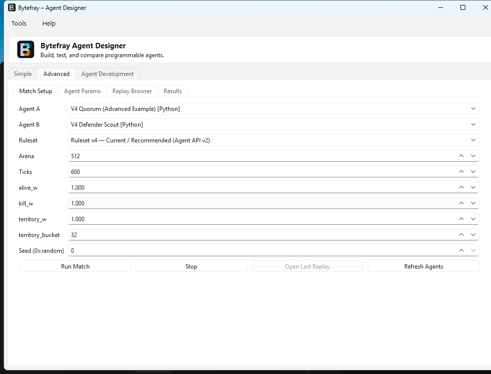
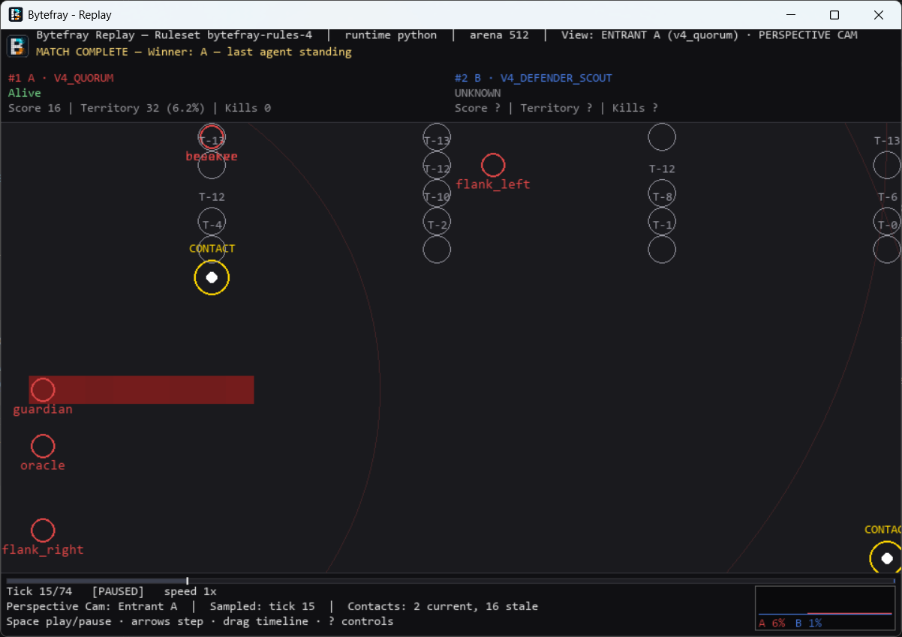

# Bytefray

<p align="center">
  
</p>

> **Note: Bytefray v4.0.0-rc2 is now available as a release candidate.** RC2 adds a self-contained Linux binary distribution and an official Ubuntu 24.04 build baseline, migrates the replay/GUI dependency to pygame-ce, formally qualifies Python 3.14, and bundles the `V4 Quorum` advanced example agent, on top of RC1's stable gameplay Ruleset `bytefray-rules-4` (Agent API v2, spatial multi-process combat), spectator presentation suite (Perspective Cam, Spectator Director, Fight Night), and seeded-placement evaluation methodology. We welcome gameplay and viewer feedback!

**Bytefray** is a deterministic programmable-agent combat simulator in which
agents compete over a shared circular memory arena. Bytefray v4 adds a
Python-first spatial process game: entrants manage bounded local reach,
maneuver multiple processes to spot enemies, and weigh defensive posture
against aggressive coverage. Historical Ruleset-v1/v2 and VM workflows remain
available for compatibility.

Bytefray includes an Agent Designer, an interactive Replay Viewer, reproducible
evaluation and tournament tools, and a complete command-line workflow.

[](https://github.com/libertaine/Bytefray/releases/tag/v4.0.0-rc2)
[](pyproject.toml)
[](LICENSE)

**Current pre-release:** [Bytefray v4.0.0-rc2](https://github.com/libertaine/Bytefray/releases/tag/v4.0.0-rc2)
— see [Downloads](#downloads) below. Earlier [v3.0.0](https://github.com/libertaine/Bytefray/releases/tag/v3.0.0)
remains the current stable release for users who do not want v4 gameplay or
Agent API v2 changes.

## What is Bytefray?

Bytefray is both a game and a deterministic experimentation platform:

- Under the v4 Rulesets, Python entrants define a fixed roster of spatial
  processes and use Agent API v2 to command them.
- Processes maneuver the arena with `MOVE` and affect memory via `READ` and `WRITE` bounded by their local reach.
- Matches are reproducible from their agents, configuration, placements, seed, and Ruleset identity.
- Canonical result and replay artifacts make a completed match inspectable without rerunning agent code.

## Getting Started

1. **Install**: See [INSTALL.md](INSTALL.md) for detailed instructions.
2. **Starter Agents**: Explore the bundled v4 agents in `agents/v4_claimer`, `agents/v4_scout`, etc., to see examples of spatial mechanics.
3. **Run a Match**: Start the Agent Designer with `bytefray design`, or run a
   headless match with `bytefray run` and inspect it with `bytefray replay`.
4. **Feedback**: As this is a release candidate, please open an issue to share
   feedback on the spatial gameplay and the spectator experience.

## Bytefray v4

`bytefray-rules-4` is the **permanent, stable v4 gameplay Ruleset**,
promoted on the RC path from `bytefray-rules-4-alpha2` unchanged: same
Agent API v2, same replay schema 4, same fixed entrant quota `Q=8`,
deterministic `K=2` rotating scheduling, seed-derived core placement under
a minimum separation, round-robin intra-entrant process selection, `D=1`
temporary anchor disruption with fair redistribution, current-only local
detection, and the minimal Agent API v2 observation contract. See
[the stable Ruleset v4 reference](docs/RULES_V4.md) for the full contract.

Two prerelease identities precede it and remain fully supported,
explicitly selectable, and behaviorally frozen for reproducing historical
matches:

- **`bytefray-rules-4-alpha1`**, the production alpha endpoint of the
  completed R0-R6 research program — documented in the
  [v4 alpha1 design](docs/V4_ALPHA1_DESIGN.md).
- **`bytefray-rules-4-alpha2`**, which changed exactly two things from
  alpha1 (seed-derived core placement instead of a fixed evenly-spread
  seat layout, and round-robin instead of declared-list-priority process
  selection) — documented in the
  [v4 alpha2 gameplay contract](docs/V4_ALPHA2_DESIGN.md), with the
  evidence behind both changes in
  [the Phase 4 study](docs/V4_ALPHA2_PHASE4_GAMEPLAY_STUDY.md), and the
  evidence that no further gameplay alpha was needed in
  [the pre-RC research report](docs/research/v4/V4_PRE_RC_GAMEPLAY_EVALUATION_RESEARCH.md).

`bytefray-rules-4`'s equivalence to alpha2 is proven by a release-blocking
test corpus (`engine/tests/test_v4_stable_ruleset_equivalence.py`), not
merely declared — identical inputs under both identities produce
identical replay content, differing only in the Ruleset-identity-bearing
fields every persisted artifact already carries.

An omitted `--ruleset` for an Agent API v2 roster now resolves to
`bytefray-rules-4` across every product surface (CLI `run`/`agents test`/
`agents evaluate`/`tournament`, and Agent Designer); both alphas remain
one explicit `--ruleset` away. The reports under
[`docs/research/v4/`](docs/research/v4/) remain the evidence and decision
history behind all three identities. They are not alternate runtime
semantics: user-invocable CLI, Designer test/evaluation, tournament,
installed wheel, and frozen-executable matches all dispatch through the
same canonical v4 process runtime. Ruleset v1/v2, Agent API v1, VM/blob
execution, and historical artifacts are retained rather than reinterpreted
as v4.

## How the game works

Agents operate in one circular shared-memory arena. Writing a cell claims its
territory; reading lets an agent observe and react to the arena through the
capabilities of its runtime. Scores reflect survival, kills, and territory.
With identical inputs, a match proceeds identically and produces the same
canonical identity.

For historical Agent API v1 Python-agent play, **Ruleset v2** adds a small vulnerable core for each
entrant. An entrant is eliminated when it loses ownership of every cell in
its core, allowing decisive captures instead of relying only on territory
scores at the tick limit. Ruleset v2 supports Python entrants only.

**Ruleset v4** (stable `bytefray-rules-4`, and its two prerelease alphas) uses
Agent API v2 and adds fixed spatial processes whose anchors move
independently. `READ` and `WRITE` use absolute arena addresses; `MOVE` uses a
signed delta from the acting process anchor. All three v4 identities consume
the same per-entrant `Q=8` action budget. The stable identity and alpha2
place cores from the match seed and select processes in rotation; alpha1
instead uses a fixed evenly-spread seat layout and declared-list-priority
selection.

The engine and evaluation model support multiple entrants. Quick Match in the
Designer remains intentionally two-entrant; **Group Evaluation** is the
Designer workflow for 3+ entrants.

See the [v4 alpha2 gameplay contract](docs/V4_ALPHA2_DESIGN.md),
[v4 alpha1 design](docs/V4_ALPHA1_DESIGN.md),
[Agent API v2 contract](docs/AGENT_API_V2.md),
[Ruleset v2 reference](docs/RULES_V2.md), and
[Ruleset v1 reference](docs/RULES.md) for exact semantics.

## Agent Designer

<p align="center">
  
</p>

**Agent Designer** — create, test, and evaluate Python agents with explicit
Ruleset selection.

Agent Designer provides a native PySide6 workflow for configuring matches and
developing Python agents:

- Simple and Advanced two-entrant match setup with explicit Ruleset selection
- Python-agent discovery and canonical-ID-safe selection
- New Agent scaffolding and package import/export
- read-only inspection of the selected agent's `agent.py` and `agent.yaml`
- validation, supervised development tests, replay opening, and Agent Lab
  trace inspection
- Pairwise and Ruleset-v2 Group Evaluation with matrix preview
- evaluation history, comparison, provenance, and revision restoration

v4 matches launched from the Agent Designer (Simple or Advanced) automatically
record the spectator trace used by Perspective Cam, Spectator Director, and
Fight Night, so **Open Replay** has them available without any extra setup.

Source viewing is deliberately read-only in the 2.0 release. Use
**Open Folder** to edit an agent with your preferred editor. See the
[Agent Authoring Guide](docs/AGENT_AUTHORING.md) and
[Agent Designer workflow reference](docs/specs/agent_designer_workflow.md).

Launch it with:

```bash
bytefray design
```

## Replay Viewer

<p align="center">
  
  
</p>

**Replay Viewer** — canonical Broadcast playback plus the full spectator
suite.

The Pygame Replay Viewer reconstructs the arena directly from a canonical
replay; it never reruns the match. Broadcast mode remains fixed-rate and needs
no trace. When a matching API-v2 trace is supplied—or a companion
`trace.jsonl` is beside the replay—the spectator suite also enables:

- a responsive arena view with ownership, recent activity, trails, selection,
  and write markers
- per-entrant alive/captured status, score, territory, kills, and runtime facts
- layouts that remain readable for multi-entrant replays
- play/pause, stepping, seeking, speed, zoom/fit, event navigation, and trails
- territory history and a clear winner/termination presentation
- **Perspective Cam**, showing only a selected entrant's delivered knowledge:
  own-process reach, anonymous `CURRENT` contacts, aged `STALE` contacts, and
  historical READ samples—without inventing enemy identity or continuity
- a perspective-safe HUD that redacts unknown opponent facts during live play
- the deterministic **Spectator Director** for dynamic playback pacing
- the **Fight Night** factual event ribbon for 2-, 3-, and 4-entrant matches

```bash
bytefray replay --replay path/to/replay.jsonl --renderer pygame
bytefray replay --replay path/to/replay.jsonl --trace path/to/trace.jsonl \
  --renderer pygame --perspective A --director --fight-night
```

Press `Space` to pause, the arrow keys to step or seek, `Home`/`End` to jump,
`+`/`-` to change speed, `[`/`]` to zoom, `0` to fit, and `T` to toggle trails.
Use `V`/`P` to cycle Broadcast and entrant perspectives, `1`–`9` to select an
entrant directly, `G` to toggle Director pacing, `N` to toggle Fight Night,
and `?` for the in-viewer help panel. If the trace is missing, invalid, or
mismatched, replay viewing remains available in Broadcast mode.

## Quick Start

Bytefray supports Python 3.10 through 3.14. From a source checkout:

```bash
git clone https://github.com/libertaine/Bytefray.git
cd Bytefray
python -m venv .venv
source .venv/bin/activate                 # Windows: .venv\Scripts\activate
pip install -e .                         # core/headless
pip install -e ".[replay]"              # add pygame-ce Replay Viewer
pip install -e ".[designer]"            # add PySide6 Agent Designer
# or: pip install -e ".[gui]"            # both GUI applications
```

Try the bundled Python agents under Ruleset v2:

```bash
bytefray agents
bytefray run --a-type claimer --b-type hunter \
  --ruleset bytefray-rules-2 --ticks 600 --replay replay.jsonl
bytefray replay --replay replay.jsonl --renderer pygame
```

For headless Linux and wheel-specific guidance, see
[Linux installation](docs/LINUX_INSTALL.md). For platform data roots and
environment variables, see [Installation](INSTALL.md).

## Downloads

**Current pre-release:** [Bytefray v4.0.0-rc2](https://github.com/libertaine/Bytefray/releases/tag/v4.0.0-rc2)
— the second v4.0 **release candidate**. RC2 adds a self-contained Linux
binary distribution built and qualified on an official Ubuntu 24.04
baseline (measured maximum requirement `GLIBC_2.38`; not qualified against
Ubuntu 22.04 or Debian 12), migrates the replay/GUI dependency from classic
Pygame to pygame-ce, formally qualifies Python 3.14, and bundles the
`V4 Quorum` advanced example agent. No gameplay, Agent API, Ruleset, or
replay-schema change over RC1 — `bytefray-rules-4` remains the permanent,
stable v4 gameplay Ruleset RC1 promoted it to, unchanged. See
[CHANGELOG.md](CHANGELOG.md#400-rc2---2026-09-07) for the full release
notes.

| Package | Download | Notes |
|---|---|---|
| Windows installer | [Bytefray-Setup-4.0.0-rc2.exe](https://github.com/libertaine/Bytefray/releases/download/v4.0.0-rc2/Bytefray-Setup-4.0.0-rc2.exe) | Administrative AMD64/x64 installation; unsigned, see [Installation](INSTALL.md) |
| Portable Windows applications | [bytefray-4.0.0-rc2-windows.zip](https://github.com/libertaine/Bytefray/releases/download/v4.0.0-rc2/bytefray-4.0.0-rc2-windows.zip) | AMD64 onedir applications for the Bytefray CLI, Agent Designer, and Replay Viewer workflows |
| Self-contained Linux archive | [bytefray-4.0.0-rc2-linux-x86_64.tar.gz](https://github.com/libertaine/Bytefray/releases/download/v4.0.0-rc2/bytefray-4.0.0-rc2-linux-x86_64.tar.gz) | x86_64 onedir applications, built on Ubuntu 24.04; no system Python required, see [Linux installation](docs/LINUX_INSTALL.md) |
| Python wheel | [bytefray-4.0.0rc2-py3-none-any.whl](https://github.com/libertaine/Bytefray/releases/download/v4.0.0-rc2/bytefray-4.0.0rc2-py3-none-any.whl) | Pure Python 3.10–3.14 package; no pMARS binary |
| Source archive | [bytefray-4.0.0rc2.tar.gz](https://github.com/libertaine/Bytefray/releases/download/v4.0.0-rc2/bytefray-4.0.0rc2.tar.gz) | Python/source workflows |
| Checksums | [SHA256SUMS.txt](https://github.com/libertaine/Bytefray/releases/download/v4.0.0-rc2/SHA256SUMS.txt) | SHA-256 values for all published rc2 assets |

The prior [v4.0.0-rc1](https://github.com/libertaine/Bytefray/releases/tag/v4.0.0-rc1)
release remains published for reference — see
[CHANGELOG.md](CHANGELOG.md#400-rc1---2026-09-03) for what it shipped.

The earlier [v4.0.0-alpha4](https://github.com/libertaine/Bytefray/releases/tag/v4.0.0-alpha4)
release remains published for reference; it shipped the same gameplay under
the `bytefray-rules-4-alpha2` identity plus the Designer trace-recording
follow-up RC1 also carries forward unchanged.

**Current stable release:** [Bytefray v3.0.0](https://github.com/libertaine/Bytefray/releases/tag/v3.0.0)
remains available for users who do not want v4 gameplay or Agent API v2
changes.

Use the [GitHub Releases page](https://github.com/libertaine/Bytefray/releases)
for the prereleases that led up to v3.0.0.

**Previous major release:** [Bytefray v2.0.0](https://github.com/libertaine/Bytefray/releases/tag/v2.0.0)
— Vulnerable Core. Promotes the qualified `v2.0.0-rc2` candidate with no
software change; adds the permanent Ruleset v2 (`bytefray-rules-2`)
alongside frozen Ruleset v1.

| Package | Download | Notes |
|---|---|---|
| Windows installer | [Bytefray-Setup-2.0.0.exe](https://github.com/libertaine/Bytefray/releases/download/v2.0.0/Bytefray-Setup-2.0.0.exe) | Administrative AMD64/x64 installation |
| Portable Windows applications | [bytefray-2.0.0-windows.zip](https://github.com/libertaine/Bytefray/releases/download/v2.0.0/bytefray-2.0.0-windows.zip) | Complete onedir layouts for all four executables |
| Python wheel | [bytefray-2.0.0-py3-none-any.whl](https://github.com/libertaine/Bytefray/releases/download/v2.0.0/bytefray-2.0.0-py3-none-any.whl) | Pure Python 3.10–3.13 package; no pMARS binary |
| Source archive | [bytefray-2.0.0.tar.gz](https://github.com/libertaine/Bytefray/releases/download/v2.0.0/bytefray-2.0.0.tar.gz) | Python/source workflows |
| Checksums | [SHA256SUMS.txt](https://github.com/libertaine/Bytefray/releases/download/v2.0.0/SHA256SUMS.txt) | SHA-256 values for 2.0.0 assets |

See [Bytefray v1.6.0](https://github.com/libertaine/Bytefray/releases/tag/v1.6.0)
for the earlier stable 1.x line and the
[GitHub Releases page](https://github.com/libertaine/Bytefray/releases) for
historical alpha, beta, and release-candidate builds.

Windows installer data defaults to `%ProgramData%\Bytefray`; regular Windows
wheel installs default to `%LOCALAPPDATA%\Bytefray`. `BYTEFRAY_ROOT` explicitly
overrides the data root. The installer requires administrative installation
and targets AMD64/x64; no Windows ARM64 support is claimed.

## Creating an Agent

The shortest GUI path is:

```text
Agent Designer → New Agent → inspect agent.py / agent.yaml
               → edit externally → Validate → Test → Replay / Evaluate
```

The equivalent CLI loop is:

```bash
bytefray agents create my_agent
bytefray agents validate my_agent
bytefray agents test my_agent --opponent claimer
bytefray agents inspect <printed-run-directory>
bytefray agents evaluate my_agent --opponents claimer,hunter --seeds 1,2,3
```

Validation and development tests use timeout-bounded worker processes by
default so a non-returning agent call can be contained. This is development
hang containment, not a security sandbox: Python agents are ordinary executable
code and should be treated accordingly.

Fresh installations include bundled Agent API v1 and Agent API v2 Python
examples, plus four VM starters (`runner`, `writer`, `seeker`, and `spiral`).
Each Python starter documents its strategy and is intended to be read,
copied, modified, tested, and evaluated.

Five teach the fundamentals of claiming territory — `claimer` (a blind
fixed-stride sweep), `strider` (the same sweep plus periodic re-defense of
ground already held), `hunter` (scatter widely first, then fill in),
`wanderer` (a per-seed randomized sweep order), and `adaptive` (phase
switching driven by the engine's own `pc`/`JUMP`).

Two demonstrate Ruleset v2's defining Vulnerable Core mechanic, which the
territorial five never touch:

- `raider` — searches with `READ` for evidence of an enemy core, confirms
  the location before committing, then attacks it. Winning outright by
  taking a core is a different strategy from out-claiming an opponent, and
  the search costs real budget.
- `sentinel` — spends one action in every four re-securing its own core
  instead of expanding, making the cost of defending measurable.

None of them is an optimal strategy, and the two above generally hold less
territory than the pure expanders — that trade-off is the lesson. Try
`bytefray agents test raider --opponent claimer --ruleset bytefray-rules-2`
and watch the replay.

The `v4_*` starters demonstrate the v4 process model. `v4_defender_scout`
declares two co-located processes with equal shares, while most of the
others provide single-process controls; their `READ`/`WRITE` operands are
absolute arena addresses and their `MOVE` operands are signed relative
deltas. `v4_quorum` is the advanced example: it coordinates six declared
processes with different reach/share roles to demonstrate a substantially
richer Agent API v2 strategy.

See [Writing Agents](docs/AGENT_AUTHORING.md), the
[Agent API v2 contract](docs/AGENT_API_V2.md), the
[Agent API v1 contract](docs/AGENT_API_V1.md), and
[Agent Lab](docs/AGENT_LAB.md).

## Rulesets

| Ruleset | Designer role | Runtime compatibility |
|---|---|---|
| `bytefray-rules-4` | Current, permanent v4 gameplay Ruleset for spatial process matches | Agent API v2 Python entrants only |
| `bytefray-rules-4-alpha2` | Historical prerelease, for reproducing earlier alpha2 matches | Agent API v2 Python entrants only |
| `bytefray-rules-4-alpha1` | Historical prerelease, for reproducing earlier alpha1 matches | Agent API v2 Python entrants only |
| `bytefray-rules-2` | Current/recommended for compatible Python direct matches | Python entrants only |
| `bytefray-rules-1` | Compatibility: historical reproduction, and the only ruleset that runs VM/blob entrants | VM/blob and Python native matches |

Agent API v1 Python agents run under Ruleset v1 or v2. Agent API v2 Python
agents run under any of the three v4 identities; omitting `--ruleset` selects
`bytefray-rules-4`, the current, permanent v4 gameplay Ruleset. VM/blob agents
run under Ruleset v1 only. Redcode/pMARS is separate from all five — see
below.

Agent Designer passes its selection explicitly everywhere, including the
Agent Development tab's development tests and pairwise evaluation, both of
which default to Ruleset v2 (for an Agent API v1 roster) or `bytefray-rules-4`
(for an Agent API v2 roster) as of `v4.0.0-rc1` Phase 2. The CLI (`bytefray
run`, `agents test`, `agents evaluate`, `tournament`) resolves an omitted
`--ruleset` the same way: Agent API v1 Python-only matches default to Ruleset
v2, Agent API v2 Python-only matches default to `bytefray-rules-4`, and
VM/blob-only matches default to Ruleset v1, so an ordinary match gets the
same current gameplay through either front end. A mixed Python/VM request
without an explicit `--ruleset` keeps the historical Ruleset v1 default.
Ruleset v2 is a permanent, stable gameplay identity as of `v2.0.0`;
`bytefray-rules-4` is a permanent, stable gameplay identity as of
`v4.0.0-rc1` Phase 2. Historical alpha identities remain readable/executable
for artifact compatibility but are not normal product choices.

Detailed references:

- [Ruleset v4 (stable)](docs/RULES_V4.md)
- [Ruleset v4 alpha2 gameplay contract](docs/V4_ALPHA2_DESIGN.md)
- [Ruleset v4 alpha1 design](docs/V4_ALPHA1_DESIGN.md)
- [Ruleset v2](docs/RULES_V2.md)
- [Ruleset v1](docs/RULES.md)
- [Compatibility model](docs/COMPATIBILITY.md)

## CLI and Common Workflows

```bash
bytefray --help
bytefray run --help
bytefray tournament runner writer seeker --rounds 2
bytefray agents evaluations list
bytefray agents evaluations show <evaluation-id-or-path>
bytefray agents evaluations compare <left> <right>
bytefray agents export my_agent
bytefray agents package show <package.bytefray-agent>
bytefray agents import <package.bytefray-agent>
```

Pairwise evaluation measures one candidate against explicit opponents and
seeds. Group Evaluation fields a focus agent and roster together under Ruleset
v2, covering standard layouts and distinct seat assignments:

```bash
bytefray agents evaluate focus_agent --ruleset bytefray-rules-2 --group \
  --opponents agent_b,agent_c --seeds 1,2,3
```

Use `tournament` for round-robin standings among peers; use `agents evaluate`
for controlled candidate analysis. See [Agent Lab](docs/AGENT_LAB.md) and
[Tournaments](docs/TOURNAMENTS.md).

### Redcode / pMARS interoperability

```bash
bytefray run --mode redcode94 --red-a path/to/A.red --red-b path/to/B.red
```

Redcode/pMARS matches run in an external pMARS process and do not use a
Bytefray ruleset — not Ruleset v1, v2, or any v4 identity. They produce a normalized
summary rather than a native Bytefray replay. See
[RULES.md](docs/RULES.md)'s "Redcode/pMARS — not Ruleset v1".

Windows CLI application packages include pMARS and its GPLv2 licensing
materials. The pure Python and Linux wheels do not include a pMARS executable.
See [pMARS build/runtime guidance](README.md) and
`third_party_licenses/`.

## Documentation

- [Agent Authoring Guide](docs/AGENT_AUTHORING.md)
- [Agent API v2 Technical Contract](docs/AGENT_API_V2.md)
- [Agent API v1 Technical Contract](docs/AGENT_API_V1.md)
- [v4 Spectator Perspective Contract](docs/specs/v4_spectator_perspective.md)
- [Ruleset v4 Alpha2 Gameplay Contract](docs/V4_ALPHA2_DESIGN.md)
- [Ruleset v4 Alpha1 Design](docs/V4_ALPHA1_DESIGN.md)
- [Agent Lab: trace, inspect, diverge, timeouts, and evaluation](docs/AGENT_LAB.md)
- [Ruleset v2 Reference](docs/RULES_V2.md)
- [Ruleset v1 Reference](docs/RULES.md)
- [Result Schema](docs/RESULT_SCHEMA.md) and [Replay Schema](docs/REPLAY_SCHEMA.md)
- [Tournament Service](docs/TOURNAMENTS.md)
- [Compatibility Reference](docs/COMPATIBILITY.md)
- [Installation](INSTALL.md) and [Linux wheel installation](docs/LINUX_INSTALL.md)
- [Architecture](ARCHITECTURE.md)
- [Roadmap and milestone history](docs/ROADMAP.md)
- [Future Plans](docs/FUTURE_PLANS.md)
- [Changelog](CHANGELOG.md)

## Platforms and Packaging

- Runtime support: Python 3.10–3.14
- Core dependency: PyYAML
- Optional GUI dependencies: pygame-ce (`replay`, via the standard `pygame`
  Python namespace) and PySide6 (`designer`)
- Headless-first pure wheel for Linux and automation
- Windows AMD64 installer and portable package with four onedir applications:
  `bytefray`, `bytefray-cli`, `bytefray-agent-designer`, and
  `bytefray-replay-viewer`
- **macOS is not a currently supported or tested distribution target.**
  No macOS build, packaging, or CI job exists; the pure Python wheel may
  work there in principle (Pygame and PySide6 both publish macOS wheels
  upstream) but this is untested and unsupported. Report macOS results as
  a GitHub issue if you try it.

The primary dispatcher is `bytefray`; obsolete predecessor command and
executable names are not supported. Internal `battle_engine`/`battle_client`
package names and `battle2.result`/`battle2.replay` schema identifiers remain
stable compatibility surfaces.

For development setup, testing, and contribution workflow, see
[CONTRIBUTING.md](CONTRIBUTING.md), [Architecture](ARCHITECTURE.md), and
[Windows development notes](docs/WINDOWS_DEV_NOTES.md).

## Project Status and Roadmap

Bytefray's stable 1.x line established Agent API v1, Ruleset v1, canonical
result/replay schemas, reproducible evaluation, provenance, package sharing,
and architecture boundaries. Bytefray 2.0 adds the permanent, Python-only
Ruleset-v2 vulnerable-core game and scales evaluation and presentation to
multi-entrant work, together with explicit Designer Ruleset selection,
read-only agent-source inspection, refreshed onboarding, and current product
screenshots.

Bytefray v3.0.0 remains the stable product on top of Ruleset v2. Bytefray
v4.0.0-rc2 is the current pre-release: the second v4.0 release candidate,
building on RC1's promotion of `bytefray-rules-4` to a permanent, stable
gameplay Ruleset alongside the qualified spectator intelligence suite
(Perspective Cam, Spectator Director, Fight Night) and the seeded-placement
evaluation methodology, independently qualified on both Windows and
native-Wayland Linux. RC2 adds a self-contained Linux binary distribution
and an official Ubuntu 24.04 build baseline; it carries no new gameplay
mechanic, Agent API redesign, or replay schema bump over RC1; historical
alpha1/alpha2 identities and wire formats remain distinct, selectable, and
readable.

The earlier BATTLE2 name and migration history are preserved in
[Project History](docs/PROJECT_HISTORY.md); all current product commands,
executables, paths, and environment variables use Bytefray naming.

## AI-Assisted Development

Bytefray development may use AI-assisted coding, review, and bounded local
model tooling under human direction. This is development methodology, not a
runtime feature. No LLM is required to build or run Bytefray, author agents,
execute matches or tests, use either GUI, or produce a release.

See [Development Method](docs/DEVELOPMENT_METHOD.md) for the complete policy.

## License

Bytefray is released under the [MIT License](LICENSE).

pMARS is separate GPL-licensed interoperability software; distributions that
bundle it preserve the applicable materials under `third_party_licenses/`.

---

☕🍕 If Bytefray has been useful or entertaining, you can [buy me a coffee or pizza via PayPal](https://www.paypal.com/donate/?hosted_button_id=DRJD388WT8DAL). Contributions are entirely optional.
