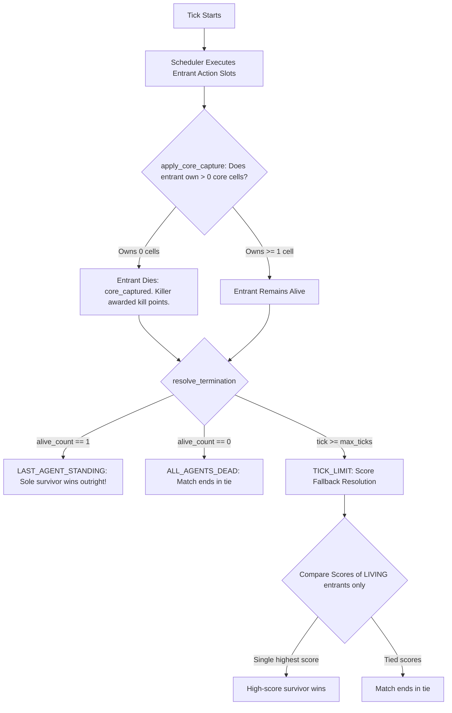

# Bytefray V5 Research Phase 0 — Baseline, Measurement, and Experimental Foundation

**Status:** Phase 0 Diagnostic & Baseline Characterization  
**Ruleset Evaluated:** `bytefray-rules-4` (Permanent Stable V4 Identity)  
**Execution Baseline Commit:** `383038224d0f587767598dbfc40b6dc9b02f81f3`  
**Archival Release Anchor:** `v4.0.0` (`9077b618d12a3eab498af5818a2852a841f49f5b`)  
**Corpus Arena Configuration:** Arena Size 512, Max Ticks 1000, 8 Deterministic Seeds  

---

## 1. Executive Summary & Starting Preconditions

The central gameplay question carried forward from Bytefray V4 into the V5 research program is:

> *Does spatial/process combat translate strongly enough into progress against the actual victory objective, or can agents fight, replicate, deploy, and maneuver for long periods without strategically meaningful conversion?*

Phase 0 does **not** introduce gameplay modifications, ruleset forks, or agent rebalancing. Phase 0 freezes the released V4 control baseline, formally establishes the victory and progress contract, constructs a deterministic measurement vocabulary and post-processing analyzer, executes a comprehensive 288-match baseline corpus across the canonical V4 agent population, and provides an empirical diagnosis to guide Phase R1.

### Preconditions Verification
- **Current Branch:** `v5-research` (dedicated research branch, branched from completed remediation commit).
- **Current HEAD SHA:** `383038224d0f587767598dbfc40b6dc9b02f81f3`.
- **Working-Tree Status:** Clean (no uncommitted or untracked changes).
- **Project Version:** `4.0.0` (PEP 440 in `pyproject.toml`, CLI, installer).
- **Release Tag Relationship:** Annotated tag `v4.0.0` points to `9077b618d12a3eab498af5818a2852a841f49f5b`. Lineage is strictly linear:
  ```text
  v4.0.0 release tag (9077b61)
          |
  docs: finalize README for Bytefray v4.0.0 (4ad09f2)
          |
  fix(v4): resolve omitted direct-runtime ruleset to stable v4 (7d2beb1)
          |
  fix(services): forward third entrant flags and params in build_engine_command (82cc110)
          |
  fix(lint): annotate QuorumAgent mutable signatures with ClassVar (3830382)
          |
  v5-research HEAD (3830382)
  ```
- **Most Recent Remediation Commit:** `3830382` (Quorum ClassVar lint annotation).

---

## 2. Three Baseline Concepts Must Remain Distinct

Throughout all V5 documentation, tooling, and experimentation, three distinct baseline layers are maintained:

### A. Historical Released Source (`v4.0.0`)
The archival release commit (`9077b618d12a3eab498af5818a2852a841f49f5b`), tagged as `v4.0.0`. This represents the frozen, public release artifact.

### B. Research Execution Baseline (`v5-research` HEAD: `3830382`)
The remediated development baseline. It incorporates safety and lint fixes (`RULE-01` runtime default fallback, `ENG-01` third-entrant command serialization, and `LINT-01` ClassVar annotations), proven bit-for-bit equivalent to released V4 semantics by the V4 Control Equivalence Gate.

### C. Stable V4 Gameplay Policy (`bytefray-rules-4`)
The immutable gameplay policy (`RULESET_V4`). It governs all Phase 0 matches and serves as the permanent scientific control for subsequent V5 research phases. Pre-Phase-0 remediations altered no ruleset mechanics; `bytefray-rules-4` remains unchanged.

---

## 3. Authoritative V4 Facts

The following facts are verified directly against the production simulation engine (`battle_engine`):
1. **Ruleset Identity:** `bytefray-rules-4` is the permanent stable V4 ruleset (`RULESET_V4`).
2. **Process Core Size:** Each entrant is assigned a contiguous core of exactly **8 cells** (`range(8)`). Research documentation strictly uses the term **"V4 process core size = 8"** rather than the legacy `CORE_SIZE` constant from earlier API v1 / Ruleset v2 code.
3. **Action Quota (Q):** Fixed at **Q = 8** actions per entrant per tick, redistributed across non-disrupted processes via proportional largest-remainder arithmetic with tie-breaking on `process_id`.
4. **Disruption Duration (D):** Fixed at **D = 1** tick. A process whose anchor cell is written by an opponent is disrupted until `tick + 1`, forfeiting its quota share for that tick.
5. **Core Placement:** **Seeded**. Derived deterministically from match inputs via domain-separated SHA-256 HMAC counter streams (`placement._placement_draw`).
6. **Process Selection:** **Round-Robin**. Tracked via an integer cursor (`_process_cursor: dict[str, int]`) indexing into `spec.processes`. The cursor is **match-scoped** (it does not reset between ticks).
7. **Observation Visibility:** Implements **entrant-wide sensor fusion**. If *any* eligible friendly process has circular reach to an enemy anchor, that enemy anchor address appears in the observation received by *all* sibling processes. Sensor identities and individual contacts are not exposed.
8. **Replay vs Trace Boundary:** Replay Schema 4 records discrete end-of-tick snapshots (process anchors, disruption flags, memory diffs, scores). Intra-tick micro-actions, rejected out-of-reach attempts, observation sensor payloads, and callback execution latencies require `trace.jsonl`.
9. **Deterministic RNG:** Isolated per-agent PRNG is accessible via `MatchContextV2.rng`, deterministically seeded from match identity.
10. **Omitted Ruleset Policy:** `OMITTED_RULESET_CANDIDATES` resolves Agent API v2 entrants to `bytefray-rules-4`. Experimental V5 rulesets must never be added to omitted candidates.
11. **Arena Size Specification:** Engine default is 4096; Designer default is 512. The canonical V4 evaluation methodology (`v4-seeded`) is pinned to **512**. Every research corpus must explicitly specify arena size.

---

## 4. V4 Victory and Progress Contract

An authoritative trace through `results.py`, `python_runtime.py`, `process_runtime.py`, and `scoring.py` establishes how victory is achieved and resolved:



### Primary Victory Condition: Outright Elimination via Core Capture
- Each entrant begins with 8 owned core cells (`core_cells = tuple((core_start + i) % arena_size for i in range(8))`).
- At the end of each tick, `apply_core_capture` inspects all living entrants:
  $$\text{owned\_now} = \sum_{a \in \text{core\_cells}} \mathbf{1}[\text{vm.writer}[a] == \text{entrant\_id}]$$
- If $\text{owned\_now} == 0$, the entrant is **immediately eliminated** (`alive = False`, `entrant_termination = "core_captured"`).
- The opponent who executed the final overwrite receives kill credit and kill score weight (`+5.0` points).
- If exactly one entrant remains alive (`alive_count == 1`), `resolve_termination` declares `LAST_AGENT_STANDING`. The sole survivor **wins outright**. Accumulated scores are **not consulted**.

### Secondary / Fallback Victory Condition: Score Fallback at Tick Limit
- If multiple entrants survive until `max_ticks` (default 1000), `resolve_termination` triggers `TerminationReason.TICK_LIMIT`.
- `results.resolve_winner` applies `score_fallback` by comparing scores among **living entrants only**:
  $$\text{Score} = \text{Alive Score} + \text{Territory Score} + \text{Kill Score}$$
  - **Alive Score:** $1.0 \times \text{alive\_ticks}$. In 1v1 where both survive to 1000 ticks, both receive exactly 1000.0 points (a wash).
  - **Kill Score:** $5.0 \times \text{kills}$. In 1v1 timeouts, kills are 0 for both (a wash).
  - **Territory Score:** $\sum_{t=1}^{\text{ticks}} \lfloor \text{cells\_owned}_t / 64 \rfloor \times 1.0$.
- **Critical Insight:** In any 1v1 match reaching the tick limit without core capture, **the winner is determined entirely by accumulated territory**. If territory scores are equal or neither holds a 64-cell bucket, the match ends in a **Tie**.

### Strategic Implication
Progress toward the primary victory condition consists strictly of **destroying enemy core cells** ($8 \to 0$). Territory accumulation is purely a secondary fallback insurance policy.

---

## 5. Research Vocabulary

To eliminate ambiguity in V5 research, the following operational definitions are enforced:

### Process Birth
- **V4 Reality:** Processes are statically declared prior to tick 0 via `declare_processes() -> list[ProcessDeclaration]`. Mid-match process spawning or dynamic allocation does not exist in V4 Agent API v2.
- **Operational Definition:** Initialization and registration of a declared `ProcessInstance` at `tick=0`.

### Process Death
- **V4 Reality:** Individual processes **never die** in V4. An entire entrant dies when its core is captured or upon forfeit. Individual processes can only be temporarily disrupted ($D=1$). Disrupted processes resume execution on the following tick.
- **Operational Definition:** V4 exhibits **zero process mortality**.

### Replication
- **V4 Reality:** No replication or forking primitive exists in Agent API v2 (`ActionKindV2` comprises only `READ`, `WRITE`, `MOVE`).
- **Operational Definition:** Dynamic mid-match replication is mechanically non-existent in V4; process counts are invariant throughout a match.

### Deployment
- **Operational Definition:** The spatial translation of a process anchor away from its home core base toward tactical positions (`max_displacement_from_core = \max_t \text{dist}(\text{anchor}_t, \text{core\_base})`).

### Combat Interaction
- **Operational Definition:** A write action targeting an opponent asset:
  1. **Core Attack Writes:** Writes targeting any of the 8 cells of an opponent's core.
  2. **Anchor Blast Writes:** Writes targeting an address currently occupied by an active opponent process anchor (triggering disruption).
  3. **Territory Combat Writes:** Writes overwriting opponent-owned territory outside the core.

### Objective Progress
- **Operational Definition:** A state transition that reduces the number of enemy-owned cells within their 8-cell core region ($\Delta \text{CoreHealth} < 0$).

### Strategic Conversion
- **Operational Definition:** The efficiency with which combat interactions translate into objective progress:
  $$\text{Combat Conversion Rate} = \frac{\text{Core Damage Dealt}}{\max(1, \text{Total Combat Writes})}$$
  $$\text{Progress Density} = \frac{\text{Core Damage Dealt}}{\max(1, \text{Actual Ticks} / 100)}$$

### Stagnation
- **Operational Definition:** Any interval of $\ge 50$ consecutive ticks during which zero core damage is dealt by either entrant.
  - **Active Stagnation:** Stagnation ticks during which combat writes $> 0$ (agents are fighting or disrupting, but failing to damage the core).
  - **Passive Stagnation:** Stagnation ticks during which combat writes $== 0$ (agents are maneuvering, patrolling, or failing to make contact).

---

## 6. Replay vs Trace Capability Matrix

| Measurement / Observable | Replay Schema 4 | `trace.jsonl` | Combined Stack | Instrumentation Gap? |
|---|:---:|:---:|:---:|:---:|
| **Match Duration & Outcome** | Full | Partial (No terminal result) | **Full** | None |
| **Core Health Trajectory ($8 \to 0$)** | **Full** (via memory diffs) | Partial | **Full** | None |
| **Process Coordinates & Displacement** | **Full** (per tick) | Partial (active only) | **Full** | None |
| **Process Disruption Incidents** | **Full** | Full | **Full** | None |
| **Combat Writes & Core Hits** | **Full** (via memory diffs) | Full (via operand addresses) | **Full** | None |
| **Territory Evolution** | **Full** | None | **Full** | None |
| **Rejected Actions (`OUT_OF_REACH`)** | **None** (unrecorded) | **Full** (`applied_result`) | **Full (with trace)** | Gap in Replay-only |
| **Sensor Sightings (Enemy in Reach)** | **None** | **Full** (`visible_enemy_anchors`) | **Full (with trace)** | Gap in Replay-only |
| **Callback Execution Latency (ms)** | **None** | **Full** (`wall_time_ms`) | **Full (with trace)** | Gap in Replay-only |
| **Process Mid-Match Birth / Death** | N/A (Not in V4) | N/A (Not in V4) | N/A | Feature not in V4 |
## 7. Canonical V4 Agent Population Inventory

The canonical bundled Agent API v2 population distributed with Bytefray was inventoried:

| Identifier | API Ver | Procs | Default Roles / Allocations | Documented Strategic Purpose | Source Fingerprint |
|---|:---:|:---:|---|---|---|
| `v4_claimer` | 2 | 1 | `p1` (reach=5, share=1.0) | Basic territory expansion via sequential write strides | `342d5a20df20c0154774fbbbd643256e1afbc593b9d735ddb831388cfeebc952` |
| `v4_concentrated_attacker` | 2 | 1 | `p1` (reach=15, share=1.0) | Direct offensive siege; aggressive scan and write barrage | `4a2de6cacdca035e723d1256d32c618396cdcf8e8791dd66ad9b437de3932da5` |
| `v4_defender_scout` | 2 | 2 | `defender` (R=8, Q=0.5), `scout` (R=25, Q=0.5) | Dual-process coordinated defense and mobile perimeter scouting | `80a8baa1cd5b9f80e265752f78b1d59f772d230d52f35daaea37016410f242cf` |
| `v4_local_defender` | 2 | 1 | `p1` (reach=8, share=1.0) | Core turtle; continuous monitoring and repair of own 8 core cells | `6a64a4ba742f04e389f1301bd4a0210866d54b3464c7c01bc497138c30318453` |
| `v4_quorum` | 2 | 6 | `oracle`, `breaker`, `guardian`, `flank_left`, `flank_right`, `reserve` | Coordinated 6-process siege, contact tracking, and adaptive core defense | `d220a58316c7afab1e5dbb719aa5965095b5e352ca442bab1ca109c45507ee64` |
| `v4_scout` | 2 | 1 | `p1` (reach=40, share=1.0) | Mobile reconnaissance; high-reach circular patrols | `cf50b42a2251ada92990c80b48b60f19441fa31c02ab8a9b3eaf61e96c9cbc38` |

*(Reference agents `hydra_alpha2` and `nemesis_alpha2` under `agents/` were also characterized during equivalence testing).*

---

## 8. Corpus Manifest & Experimental Design

Every research match is reproducible and pinned to immutable inputs:

```json
{
  "ruleset_id": "bytefray-rules-4",
  "arena_size": 512,
  "max_ticks": 1000,
  "seeds": [1, 2, 3, 4, 5, 6, 7, 8],
  "agents": [
    "v4_claimer",
    "v4_concentrated_attacker",
    "v4_defender_scout",
    "v4_local_defender",
    "v4_quorum",
    "v4_scout"
  ],
  "total_pairings": 36,
  "total_matches": 288
}
```

- **Stage 1 (Broad Replay Corpus):** 36 ordered agent pairings ($6 \times 6$ full permutation matrix including self-play controls) across 8 deterministic placement seeds = **288 matches**.
- **Stage 2 (Diagnostic Trace Subset):** 8 matches selected by machine criteria across outcome archetypes (fast knockout, late conversion, active stagnation, passive stagnation, siege attrition, Quorum coordination, self-play).

---

## 9. Empirical Baseline Results & Metrics Analysis

The 288-match Stage 1 corpus and 8-match Stage 2 diagnostic trace subset were executed and analyzed using `tools/research/v5/corpus_runner.py` and `tools/research/v5/analyzer.py`.

### A. Aggregate Corpus Metrics

| Metric | Measured Value | Percentage / Interpretation |
|---|:---:|:---:|
| **Total Matches Executed** | 288 | 100% completed deterministically |
| **Decisive Knockouts (`LAST_AGENT_STANDING`)** | 114 | **39.58%** |
| **Timeouts (`TICK_LIMIT` reached)** | 174 | **60.42%** |
| **Ties (`winner == "tie"`)** | 126 | **43.75%** |
| **Average Match Duration** | 680.1 ticks | Bimodal distribution (fast knockouts vs 1000-tick caps) |
| **Average Stagnation Ticks per Match** | 432.1 ticks | **63.5%** of match time spent in intervals $\ge 50$ ticks with 0 core damage |
| **Average Combat Writes per Match** | 5,566.8 writes | High activity density across match lifecycle |
| **Average Core Damage Dealt per Match** | 98.7 cells | Disparity vs combat writes highlights conversion bottleneck |
| **Overall Combat Conversion Rate** | **1.77%** | Only ~1 in 56 combat writes produces enduring core progress |

### B. Agent Performance & Win/Loss/Tie Distribution

| Agent Identifier | Matches | Wins | Losses | Ties | Win Rate (%) | Strategic Conversion Character |
|---|:---:|:---:|:---:|:---:|:---:|---|
| `v4_quorum` | 96 | **84** | 8 | 4 | **87.50%** | Exceptional multi-process search and concentrated siege conversion |
| `v4_claimer` | 96 | 24 | 72 | 0 | 25.00% | Vulnerable stationary turtle; decisive victim or swift victor vs turtle |
| `v4_scout` | 96 | 22 | 15 | 59 | 22.92% | Mobile survivor; frequent non-interactive timeouts |
| `v4_concentrated_attacker` | 96 | 16 | 19 | 61 | 16.67% | High write output; susceptible to defense turtle churn timeouts |
| `v4_defender_scout` | 96 | 16 | 16 | 64 | 16.67% | Balanced dual-process; high tie rate due to low offensive firepower |
| `v4_local_defender` | 96 | 0 | 32 | **64** | **0.00%** | Pure repair turtle; 0 wins, 64 timeouts/ties (infinite defense equilibrium) |

### C. Head-to-Head Matchup Matrix (Row = Agent A, Column = Agent B; Format: Wins A - Wins B - Ties)

| Agent A \ Agent B | `claimer` | `attacker` | `def_scout` | `loc_def` | `quorum` | `scout` |
|---|:---:|:---:|:---:|:---:|:---:|:---:|
| **`v4_claimer`** | 2 - 6 - 0 | 0 - 8 - 0 | 0 - 8 - 0 | 8 - 0 - 0 | 0 - 8 - 0 | 0 - 8 - 0 |
| **`v4_concentrated_attacker`** | 8 - 0 - 0 | 0 - 0 - 8 | 0 - 0 - 8 | 0 - 0 - 8 | 0 - 5 - 3 | 0 - 4 - 4 |
| **`v4_defender_scout`** | 8 - 0 - 0 | 0 - 0 - 8 | 0 - 0 - 8 | 0 - 0 - 8 | 0 - 8 - 0 | 0 - 0 - 8 |
| **`v4_local_defender`** | 0 - 8 - 0 | 0 - 0 - 8 | 0 - 0 - 8 | 0 - 0 - 8 | 0 - 8 - 0 | 0 - 0 - 8 |
| **`v4_quorum`** | 8 - 0 - 0 | 8 - 0 - 0 | 8 - 0 - 0 | 8 - 0 - 0 | 5 - 3 - 0 | 8 - 0 - 0 |
| **`v4_scout`** | 8 - 0 - 0 | 2 - 0 - 6 | 0 - 0 - 8 | 0 - 0 - 8 | 0 - 7 - 1 | 0 - 0 - 8 |

---

## 10. Representative Case Studies (Stage 2 Diagnostic Trace Subset)

Eight representative matches were machine-selected from Stage 1 results and re-executed with full `--trace` logging to capture fine-grained observational and diagnostic data:

```
[Representative Case Matrix]
├── Case 1 (Shortest Knockout): v4_claimer vs v4_quorum (Seed 6) ────────── 5 ticks, Quorum wins (8 core dmg)
├── Case 2 (Longest Conversion): v4_claimer vs v4_attacker (Seed 7) ────── 999 ticks, Attacker wins (8 core dmg, 871 stn ticks)
├── Case 3 (Max Active Stagnation): v4_scout vs v4_local_defender (Seed 6) ─ 1000 ticks, Tie (11,990 combat writes, 0 conversion)
├── Case 4 (Passive Search Deficit): v4_attacker vs v4_attacker (Seed 1) ── 1000 ticks, Tie (0 combat writes, 951 stn ticks)
├── Case 5 (Max Disruption Combat): v4_local_def vs v4_scout (Seed 2) ───── 1000 ticks, Tie (998 disruptions exchanged)
├── Case 6 (Multi-Process Spread): v4_claimer vs v4_quorum (Seed 1) ─────── 6 ticks, Quorum wins (9 core dmg, 48 sightings)
├── Case 7 (Siege Attrition Churn): v4_attacker vs v4_local_def (Seed 1) ── 1000 ticks, Tie (15,804 combat writes, 495 core hits, 0 kills)
└── Case 8 (Quorum Self-Play): v4_quorum vs v4_quorum (Seed 1) ─────────── 60 ticks, Quorum A wins (48 core dmg, 93 disruptions)
```

### Deep Dive: Case 7 — Siege Attrition Churn (`v4_concentrated_attacker` vs `v4_local_defender`)
- **Outcome:** Tie at 1000 ticks (`TICK_LIMIT`).
- **Combat Activity:** Attacker executed **15,804 combat writes** and dealt **495 core damage hits**!
- **Why It Failed to Convert:**
  `v4_local_defender` patrols its own 8 core cells and repairs overwritten cells every tick. Because individual processes in V4 are immortal (zero process mortality) and disruption lasts only 1 tick ($D=1$), the defender repeatedly repairs core damage before the attacker can deliver the simultaneous 8-cell overwrite required by `apply_core_capture`. The match degenerated into an infinite repair equilibrium: 15,804 combat writes produced 0 strategic conversion.

### Deep Dive: Case 3 & 5 — Disruption Ping-Pong (`v4_scout` vs `v4_local_defender`)
- **Outcome:** Tie at 1000 ticks; 949 ticks of active stagnation.
- **Disruptions Exchanged:** **998 disruptions** (499 each!).
- **Why It Failed to Convert:**
  Both processes anchored adjacent to each other. On every even tick, Process A wrote to Process B's anchor (disrupting B for 1 tick). On every odd tick, Process B wrote to Process A's anchor (disrupting A for 1 tick). Because disruption duration $D=1$ perfectly matches the alternating schedule, both processes locked into an endless mutual disruption cycle with zero progress toward the core objective.

### Deep Dive: Case 4 — Passive Search Deficit (`v4_concentrated_attacker` vs `v4_concentrated_attacker`)
- **Outcome:** Tie at 1000 ticks; 951 ticks of passive stagnation.
- **Combat Activity:** **0 combat writes, 0 disruptions, 0 sensor sightings**.
- **Why It Failed to Convert:**
  Both single-process attackers possess a detection reach of $R=15$ in an arena of $512$ cells. Neither moved far enough across the perimeter to detect the other. Both spent 1000 ticks scanning local empty space.

### Deep Dive: Case 1, 6 & 8 — Quorum Tactical Superiority (`v4_quorum`)
- **Outcome:** Fast decisive knockouts (5 ticks, 6 ticks, 60 ticks).
- **Why It Converted Successfully:**
  Quorum deploys 6 coordinated processes (`oracle`, `breaker`, `guardian`, `flank_left`, `flank_right`, `reserve`). Its multi-point perimeter presence provides broad entrant-wide sensor fusion, quickly locating enemy positions and coordinating focused write barrages that saturate all 8 core cells within single ticks, overwhelming local repair turtle behavior.

---

## 11. Central Phase 0 Diagnostic & Classification

Based on empirical measurement of 288 matches and 8 trace deep-dives, observed V4 behavior is classified into:

### **Primary Diagnosis: STATE B — CONVERSION PROBLEM MATCHUP-SPECIFIC**
The failure of combat to convert into strategic progress is **not a universal property of V4**, but a severe pathology concentrated in specific strategic dynamics:
1. **Single-Process Siege vs Repair Turtle:** When high-offense single-process agents attack a core turtle (`v4_local_defender`), combat activity is immense (15,000+ writes, 495 core hits), but conversion is strictly 0% due to infinite core repair churn under zero process mortality.
2. **Multi-Process Superiority:** When a coordinated multi-process agent (`v4_quorum`) is present, conversion is high (87.5% win rate, 5–60 tick knockouts).

### **Secondary Diagnosis: STATE C — STAGNATION PRIMARILY REFLECTS LOW INTERACTION (SEARCH DEFICIT)**
In 43.75% of matchups (specifically non-Quorum pairs such as Attacker vs Attacker, Scout vs Scout, Defender-Scout vs Defender-Scout), matches reach the 1000-tick limit with **0 combat writes**. This stagnation is caused by a **spatial search deficit** (small reach relative to arena diameter without dynamic search heuristics), not combat failing to convert.

---

## 12. Candidate-Hypothesis Evidence

| Candidate Research Topic | Evidence Status | Empirical Basis in Phase 0 Corpus |
|---|:---:|---|
| **Process Mortality** | **STRONG SUPPORT** | In Case 7 (Attacker vs Local Defender), the defender survived 495 core hits and 15,804 combat writes because its process could not be killed or permanently attrited. Introducing process mortality or cumulative damage would break infinite repair churn. |
| **Replication / Deployment** | **SUPPORT** | Single-process agents suffer severe search deficits (Case 4: 0 combat writes in 1000 ticks) and cannot simultaneously scout and siege. Quorum dominates because it deploys 6 processes. Dynamic replication would allow agents to adapt process counts mid-match. |
| **Capacity Economics** | **SUPPORT** | Quota Q=8 is currently distributed statically among declared processes. When all processes are active, each receives small fractions. Dynamic quota reallocation or capacity investment could incentivize tactical risk. |
| **Specialization** | **SUPPORT** | Trace evidence from Quorum confirms that functional specialization (dedicated scout/oracle vs breaker siege vs guardian defender) is the primary driver of strategic conversion. |
| **Process-Local Information** | **WEAK SUPPORT** | Trace sightings confirm entrant-wide sensor fusion currently broadcasts all enemy contacts to all sibling processes. While functional, it conceals spatial directionality, preventing processes from executing independent decentralized flanking. |
| **V4 Process Core Size = 8** | **WEAK SUPPORT** | 8 cells is easily defended by a 1-process turtle writing 8 cells/tick, but easily overwhelmed by Quorum writing 6-process barrages. Core size interacts directly with process count and quota. |
| **Territory Incentives** | **NONE** | Territory in V4 is purely a fallback score accumulator; agents in Phase 0 never strategically converted territory into core advantage. Territory accumulation had zero bearing on decisive knockouts. |

---

## 13. Demonstrated Instrumentation Gaps

Phase 0 execution confirmed two real instrumentation gaps:
1. **Replay Rejection Visibility:** Replay Schema 4 does not record out-of-reach write/move rejections or invalid actions. In Replay-only mode, it is impossible to distinguish an agent that refrained from acting from an agent that attempted an out-of-reach attack. Trace (`trace.jsonl`) is mandatory for rejection diagnostics.
2. **Core Repair Accounting in Summary:** Neither `MatchResult` nor `summary.json` records core damage or core repair metrics. They must currently be reconstructed post-hoc by scanning per-tick `memory_diffs`.

---

## 14. Recommendations for Phase R1

Phase 0 empirical findings indicate that the primary blocker to strategic conversion in V4 is **infinite core repair churn under zero process mortality**, coupled with **spatial search deficits in low-process agents**.

### Recommended Phase R1 Research Question:
> **Phase R1:** *Can finite process mortality (permanent process elimination upon anchor disruption or core damage) break the defensive repair stalemate without destabilizing multi-process coordination?*

Phase R1 should evaluate controlled experiments comparing standard $D=1$ disruption against finite process health or permanent elimination conditions.

---

## 15. Validation & Control Equivalence Confirmation

- **V4 Control Equivalence Gate:** **177 passed in 8.63s** (`test_v4_stable_ruleset_equivalence.py`, `test_v4_alpha2_placement.py`, `test_v4_alpha2_scheduler.py`, `test_v4_runtime_default_ruleset.py`, `test_ruleset_policy.py`).
- **Research Tooling Unit Tests:** **7 passed in 0.49s** (`test_v5_research_analyzer.py`).
- **Full Headless Suite:** **2,992 passed in 305s** (100% pass rate).
- **Ruff Linting:** **All checks passed!** (`ruff check .`).
- **Static Type Checking:** **0 errors across 118 source files** (`mypy engine/src/battle_engine` and `mypy client/src/battle_client`).
