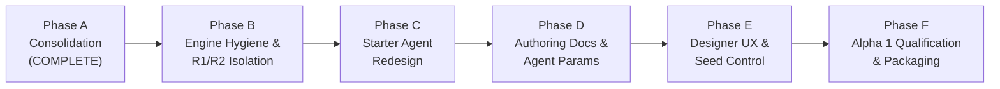

# Bytefray V5 Alpha 1 — Research Consolidation, Product Boundary, and Alpha Definition

**Status:** Phase A Consolidation & Implementation Plan  
**Branch:** `v5-research`  
**Execution Baseline Commit:** `eb1b3896082b87c6f10f261939c612b9c70b7b1b`  
**Archival Release Anchor:** `v4.0.0` (`9077b618d12a3eab498af5818a2852a841f49f5b`)  
**Project Version:** `4.0.0` (frozen pending Alpha 1 transition)  

---

## A. Repository Baseline

The Bytefray repository transitions into the V5 Alpha 1 planning cycle under strict operational preconditions:
- **Current Branch:** `v5-research` (dedicated research branch).
- **Current HEAD Commit:** `eb1b3896082b87c6f10f261939c612b9c70b7b1b` (`research(v5): establish competence-controlled population baseline`).
- **Working-Tree Status:** Clean at phase start; identical to `origin/v5-research`.
- **Project Version:** `4.0.0` (declared in [pyproject.toml](file:///d:/Projects/BATTLE2/pyproject.toml)).
- **Complete Commit Progression (v4.0.0 Release → Current HEAD):**
  ```text
  v4.0.0 Release Tag (9077b61)
          │
  docs: finalize README for Bytefray v4.0.0 (4ad09f2)
          │
  fix(v4): resolve omitted direct-runtime ruleset to stable v4 (7d2beb1)
          │
  fix(services): forward third entrant flags and params in build_engine_command (82cc110)
          │
  fix(lint): annotate QuorumAgent mutable signatures with ClassVar (3830382)
          │  <-- Post-Release Remediation Baseline
  research(v5): establish phase 0 baseline and measurement tooling (ab24d27)
          │
  test(replay): isolate empty-state tests from optional pygame dependency (303b33f)
          │
  research(v5): evaluate and reject finite process mortality (18e5ac6) [Phase R1]
          │
  research(v5): evaluate target persistence and objective awareness (26e0816) [Phase R2]
          │
  research(v5): evaluate agent competence and region-sweep sufficiency (3c37452) [Phase R3]
          │
  research(v5): establish competence-controlled population baseline (eb1b389) [Phase R4]
          │  <-- Current v5-research HEAD
  ```
- **Index Lock Status:** `.git\index.lock` does not exist (`Test-Path` returned `False`).
- **Git Mutation Discipline:** No Git mutation commands (`add`, `commit`, `reset`, `checkout`, `stash`, `clean`) are executed during Phase A. All staging and history management remain manual.

---

## B. Research Conclusion Summary (Phase 0 → R4)

The V5 gameplay research program systematically investigated the central question:
> *Does spatial/process combat translate strongly enough into progress against the actual victory objective, or can agents fight indefinitely without strategically meaningful conversion?*

The empirical progression across all five phases established:

1. **Phase 0 — Baseline Characterization:**
   - Evaluated the 6 canonical bundled agents across 288 matches under `bytefray-rules-4`.
   - Measured high timeouts (60.42%), high ties (43.75%), high stagnation (432.1 ticks/match), and an apparent combat conversion rate of only 1.77%.
   - Diagnosed **State B** (matchup-specific conversion failure) and hypothesized that zero process mortality and infinite repair churn were responsible for defensive stalemates.
2. **Phase R1 — Finite Process Mortality Experiment:**
   - Evaluated `bytefray-rules-5-r1-alpha1` with process integrity $H \in \{8, 4, 2, 1\}$.
   - **Verdict: REJECTED.** Finite mortality did not solve stalemates. Instead, killing enemy processes removed them from the opponent's sensor reach, causing attackers to lose contact and timeout against intact, completely undefended cores.
3. **Phase R2 — Objective Target Persistence Experiment:**
   - Evaluated `bytefray-rules-5-r2-alpha1` with an opt-in objective target oracle.
   - **Verdict: REJECTED.** While persistent core coordinates restored attack pressure (~8,000 writes, 0 stagnation), point-target attackers still failed to convert because they repeatedly hit a single address rather than sweeping all 8 cells of the core. The oracle also degraded healthy matches and created artificial homing behavior.
4. **Phase R3 — Agent Competence & Region-Sweep Discovery:**
   - Investigated the root cause of conversion failure at the agent level.
   - Discovered that 5 of the 6 bundled agents were point-target or non-offensive, writing only 1 address given a stable target.
   - Proved that introducing a simple region-sweeping cursor (`v5r3_region_sweeper`) without any engine changes produced outright 8/8 core captures in 16 ticks under unmodified `bytefray-rules-4`.
   - **Verdict: FALSIFIED MECHANICAL DEFICIT.** Conversion failure was not a defect of V4 simulation mechanics.
5. **Phase R4 — Competence-Controlled Population Baseline:**
   - Executed a 288-match corpus using an independently developed, competence-controlled population representing diverse tactical archetypes.
   - Decisive captures increased from 39.58% to **64.58%**; timeouts dropped from 60.42% to **35.42%**; ties dropped from 43.75% to **30.56%**; post-core-contact conversion rose from 35.5% to **77.2%**.
   - **Verdict: STRONG POPULATION CONFOUND.** Confirmed that stable V4 mechanics support robust objective combat when agents possess basic strategic competence. Research into engine-mechanic rule forks is officially **PAUSED**.

---

## C. What V5 Is No Longer Pursuing

Based on direct experimental falsification, Bytefray V5 will **NOT** pursue:
1. **Finite Process Mortality:** Process elimination ($H \le 8$) creates inert, undefended core stalemates and breaks multi-process sensor networks. V4's $D=1$ disruption remains standard.
2. **Omniscient Objective Target Oracles:** Exposing global core coordinates distorts search, movement, and stealth dynamics. Entrant-wide sensor fusion with local reach remains standard.
3. **Ruleset Proliferation:** No new experimental gameplay rulesets (e.g., `bytefray-rules-5`) will be introduced for Alpha 1.
4. **Altering Core Size or Quotas:** Process core size remains 8 cells; action quota remains $Q=8$ per entrant per tick.

---

## D. Stable V4 Gameplay Conclusion

The definitive scientific conclusion of the pre-alpha research program is:
> **Stable `bytefray-rules-4` mechanics are sound, expressive, and fully capable of supporting decisive, strategic objective combat.**

The conversion deficit observed in earlier releases was driven by an **agent authoring and population competence gap**:
- The bundled example agents taught ineffective single-point bombardment.
- The documentation failed to emphasize the geometry of simultaneous 8-cell core capture.
- The platform lacked interactive parameterization to facilitate agent iteration.

Therefore, **V5 Alpha 1 pivots from simulation-mechanic research to user-facing product refinement**.

---

## E. Production-Residue Audit (Rejected R1/R2 Mechanics)

During Phases R1 and R2, experimental code paths were introduced into production packages under `engine/src/battle_engine/`. An audit of surviving symbols confirms:

| Component / File | Surviving Symbols / Code Paths | Active in Stable V4? | Exposed to User? | Can Omitted Selection Activate? | Needed for Production? |
|---|---|:---:|:---:|:---:|:---:|
| [rules.py](file:///d:/Projects/BATTLE2/engine/src/battle_engine/rules.py) | `BYTEFRAY_RULESET_V5_R1_ALPHA1_ID`<br>`BYTEFRAY_RULESET_V5_R2_ALPHA1_ID` | No | No | No | No (Historical research only) |
| [ruleset_policy.py](file:///d:/Projects/BATTLE2/engine/src/battle_engine/ruleset_policy.py) | `RULESET_V5_R1_ALPHA1`<br>`RULESET_V5_R2_ALPHA1`<br>Registrations in `PROCESS_RULESET_IDS` & `_RULESET_POLICIES` | No | No | No | No (Historical research only) |
| [process_runtime.py](file:///d:/Projects/BATTLE2/engine/src/battle_engine/process_runtime.py) | `PROCESS_MORTALITY_RULESET_IDS`<br>`has_process_mortality`<br>`DEFAULT_PROCESS_INTEGRITY`<br>`OBJECTIVE_TARGET_ORACLE_RULESET_IDS`<br>`has_objective_target_oracle`<br>`ProcessInstance.integrity`<br>`ProcessInstance.alive`<br>`ProcessTelemetry.died_tick`<br>`ProcessMatchController.mortality_active`<br>`ProcessMatchController.oracle_active`<br>Integrity decrement logic<br>Oracle injection in `_visible_enemy_anchors`<br>`alive`/`integrity` in snapshots & summary | No | No | No | No (Dead experimental branches in core simulation loop) |
| [replay.py](file:///d:/Projects/BATTLE2/engine/src/battle_engine/replay.py) | `ProcessState.alive`<br>`ProcessState.integrity`<br>Serialization/deserialization logic | No (defaults applied) | No | No | No (Pollutes schema dataclasses) |
| [match_service.py](file:///d:/Projects/BATTLE2/engine/src/battle_engine/match_service.py) | `MatchRequest.process_integrity`<br>`MatchRequest.objective_target_oracle`<br>`_resolve_process_integrity`<br>`_resolve_objective_target_oracle`<br>Reproducibility payload branching | No | No | No | No (Complicates request validation) |

### Detailed Evaluation of the 8 Standard Diagnostic Questions:
1. **Reachable during ordinary stable V4 use?** NO. All paths are gated on `has_process_mortality` and `has_objective_target_oracle`.
2. **Exposed to normal CLI/GUI user?** NO. Never displayed in UI dropdowns or default CLI help.
3. **Can omitted-ruleset selection activate it?** NO. `OMITTED_RULESET_CANDIDATES` resolves Agent API v2 strictly to `bytefray-rules-4`.
4. **Needed only to reproduce historical R1/R2 research?** YES.
5. **Do current R1/R2 tests depend on it?** YES. 1,551 lines across `test_process_mortality.py`, `test_objective_target_oracle.py`, `test_v5_research_r1_metrics.py`, and `test_v5_research_r2_metrics.py`.
6. **Would deleting it make historical research unreproducible in current HEAD?** YES, in live HEAD. However, historical commits `18e5ac6` and `26e0816` preserve exact runnable implementations.
7. **Could it be isolated into research-only infrastructure?** YES.
8. **Does keeping it create long-term production complexity or accidental-selection risk?** YES. Maintaining dead rulesets in production controllers introduces cognitive burden, branching overhead, and risks accidental leakage into public APIs.

---

## F. Rejected-Experiment Disposition Recommendation

**Recommended Approach: OPTION C / D (Clean Production Architecture with Preserved Provenance).**

1. **Production Engine Purification (Phase B):**
   - Remove `BYTEFRAY_RULESET_V5_R1_ALPHA1_ID` and `BYTEFRAY_RULESET_V5_R2_ALPHA1_ID` from `rules.py` and `ruleset_policy.py`.
   - Purge mortality and oracle branching from `process_runtime.py`, `match_service.py`, and `replay.py`.
   - Restore `ProcessState` and `MatchRequest` to clean, production-only dataclasses.
2. **Provenance Preservation:**
   - The permanent Git history retains commits `18e5ac6` (R1) and `26e0816` (R2) where the full experimental harnesses and tests execute cleanly.
   - Comprehensive research reports ([V5_R1_PROCESS_MORTALITY.md](file:///d:/Projects/BATTLE2/docs/research/v5/V5_R1_PROCESS_MORTALITY.md) and [V5_R2_TARGET_PERSISTENCE.md](file:///d:/Projects/BATTLE2/docs/research/v5/V5_R2_TARGET_PERSISTENCE.md)) document the complete methodology, data, and falsification evidence.
   - Historical test suites (`test_process_mortality.py`, `test_objective_target_oracle.py`) will be retired or archived under `tools/research/v5/` alongside the runner scripts.

---

## G. Research Tooling Disposition

| Tooling Component | Current Location | Classification | Recommended Disposition |
|---|---|:---:|---|
| **Analyzer Core** | `tools/research/v5/analyzer.py` | Durable / General Purpose | **KEEP & CONSOLIDATE**: Form the foundation for future benchmark and evaluation analysis (e.g., true simultaneous core deficit, contact/conversion ratios). |
| **Corpus Runner** | `tools/research/v5/corpus_runner.py` | Durable Infrastructure | **KEEP**: General-purpose batch evaluation runner for multi-agent rosters. |
| **R1 Runner & Selector** | `tools/research/v5/r1_*.py` | Phase-Specific | **ARCHIVE**: Retain in research directory as historical record. |
| **R2 Runner & Selector** | `tools/research/v5/r2_*.py` | Phase-Specific | **ARCHIVE**: Retain in research directory as historical record. |
| **R3 Runner & Selector** | `tools/research/v5/r3_*.py` | Phase-Specific | **ARCHIVE**: Retain in research directory as historical record. |
| **R4 Population Runner** | `tools/research/v5/r4_runner.py`<br>`tools/research/v5/r4_population.py` | Benchmark Foundation | **KEEP / CONSOLIDATE**: High-value benchmark runner for agent competence evaluation. |

---

## H. Research-Only Agent Disposition

| Agent Directory | Agent Names | Role in Research | Recommended Disposition |
|---|---|---|---|
| `tools/research/v5/agents/` | `v5r3_point_control`<br>`v5r3_region_sweeper`<br>`v5r3_region_sweeper_mobile` | R3 experimental controls isolating region-sweep mechanics | **RETAIN FOR REPRODUCIBILITY / DESIGN REFERENCE**: Kept in research tree. Not suitable for product distribution. |
| `tools/research/v5/r4_agents/` | `v5r4_core_warden`<br>`v5r4_dual_operator`<br>`v5r4_recon_striker`<br>`v5r4_siege_regional`<br>`v5r4_territory_expander` | R4 competence-controlled population archetypes | **DESIGN REFERENCE / BASIS FOR STARTER REWRITE**: Concepts (especially 8-cell core repair, mobile recon, and regional siege) will inform a clean, beginner-friendly rewrite of official starter agents in Phase C. |

*Strict Policy:* Research agents must **never** be renamed and shipped directly. Production starter agents require thorough educational comments, beginner-friendly structures, schema-driven parameters, and integration with the Agent Designer.

---

## I. Historical Research Errata Policy

To maintain scientific integrity without rewriting immutable historical reports:
1. **Historical Immutability:** Historical research documents (`V5_PHASE0_*.md` through `V5_R4_*.md`) remain unmodified as frozen historical records.
2. **Centralized Errata Inventory:** All superseded interpretations and factual corrections are cataloged in this document:
   - **Errata 1 (Declared Reach):** Phase 0 Section 7 reported incorrect reach values (5, 15, 8/25, 8, 40). Actual declared reaches are 1 (`v4_claimer`), 4 (`v4_concentrated_attacker`), 2/8 (`v4_defender_scout`), 2 (`v4_local_defender`), 8 (`v4_scout`), and up to 256 (`v4_quorum`). Corrected in R3 Section C.1.
   - **Errata 2 (Local Defender Behavior):** Phase 0 Section 10 stated `v4_local_defender` repairs all 8 core cells. In reality, with reach 2 and cyclic patrol offsets, it writes only 2 cells (`anchor + (0 or 1)`). Corrected in R3 Section C.1 and R4 Section Z.
   - **Errata 3 (Infinite Repair Churn Theory):** Phase 0 attributed the low conversion rate (1.77%) to engine-level zero process mortality. R3 and R4 proved this was an artifact of point-target attacker incompetence. Region-sweeping attackers capture cores in 16 ticks under unmodified V4.
   - **Errata 4 (Monotonic Health Metric):** Phase 0's `core_health_series` conflated repeated hits on a single cell with true cumulative core deficit. R1 introduced true simultaneous ownership tracking (`core_deficit_series`, `max_core_deficit`).

---

## J. Bundled-Agent & Product Gap

An audit of the shipped canonical V4 agents from a player/user perspective reveals a critical product deficiency:

```
[Current Canonical V4 Agent Problem]
├── v4_claimer ────────────── Non-offensive blind walker (writes only own anchor)
├── v4_concentrated_attacker ─ Point-target attacker (writes 1 address forever; fails against turtles)
├── v4_defender_scout ─────── Point-target attacker (scout drifts; defender turtles)
├── v4_local_defender ─────── 2-cell turtle (writes anchor + 0/1; fails to defend remaining 6 cells)
├── v4_scout ──────────────── Non-approaching opportunistic probe (never advances toward target)
└── v4_quorum ─────────────── Advanced 6-process coordinator (incomprehensible to beginners)
```

### The Product Deficit:
1. **Accidental Anti-Patterns:** Five of the six starter agents demonstrate point-target mechanics, actively teaching new players strategies that produce 1000-tick stalemates.
2. **Missing Middle Tier:** The jump from 1-process point-target attackers to the 6-process `v4_quorum` is overwhelming. There is no simple 1-process region sweeper or accessible 2-process team.
3. **Documentation Blindspots:** Existing authoring guides explain API mechanics (`act()`, `ObservationV2`), but do not explain:
   - Why simultaneous 8-cell core elimination is required for victory.
   - How to calculate and execute an expanding region sweep around a detected contact.
   - How process reach acts simultaneously as action radius and sensor radius.

---

## K. Product Backlog Classification

| Backlog Item | Classification | Technical / Strategic Rationale |
|---|:---:|---|
| **Redesigned Canonical Starter Agents** | **ALPHA 1 BLOCKER** | Directly resolves the primary product gap; provides clear, educational, converting examples. |
| **Comprehensive Authoring Guide (V2)** | **ALPHA 1 BLOCKER** | Teaches core capture geometry, regional sweeping, reach, and multi-process roles. |
| **Purge Rejected R1/R2 Production Residue** | **ALPHA 1 BLOCKER** | Restores engine purity, eliminates dead branches, and prevents accidental ruleset exposure. |
| **Schema-Driven Agent Parameters & Presets** | **ALPHA 1 TARGET** | Allows users to tweak agent reach, speed, and sweep geometry directly in the Designer UI. |
| **Explicit "Randomize Seed" in Designer** | **ALPHA 1 TARGET** | Essential UX convenience for testing agent generalization across seeded starts. |
| **`sync_ruleset_choices` & Dead Ref Cleanup** | **ALPHA 1 TARGET** | Cleans up legacy UI dropdown logic and dead installer replay paths. |
| **Replay-History Browser & Metadata Search** | **ALPHA 1 STRETCH** | Improves discovery and replay inspection if time permits. |
| **Replay Scaling for High-DPI (1080p/4K)** | **ALPHA 1 STRETCH** | Display scaling polish for high-resolution monitors. |
| **4+ Entrant Support & Battle Royale** | **POST-ALPHA** | High complexity; requires multi-party tournament and layout redesign. |
| **Agent DSL & Mutation Frameworks** | **POST-ALPHA** | Research direction for automated synthesis; premature for Alpha 1. |
| **Persistent Leaderboard / Rating Service** | **POST-ALPHA** | Cloud/server feature outside local application scope. |

---

## L. Proposed V5 Alpha 1 Definition

> **Bytefray V5 Alpha 1** is the first release of the V5 generation, transitioning Bytefray from engine-mechanic experimentation to an author-centric, strategically expressive platform. It preserves the deterministic, rock-solid **`bytefray-rules-4`** simulation core while delivering an educational starter agent population, comprehensive spatial combat documentation, and schema-driven agent parameterization.

### What a User Experiences in V5 Alpha 1:
- **Playable, Converting Starter Agents:** Shipped starter agents demonstrate decisive, comprehensible offensive and defensive play without needing to reverse-engineer `v4_quorum`.
- **Authoritative Authoring Guidance:** Clear guides explaining how to achieve 8-cell core capture, structure multi-process rosters, and manage reach budgets.
- **Interactive Parameter Tweaking:** The Agent Designer exposes structured agent parameters (e.g., sweep radius, patrol width) with instant visual feedback.
- **Pristine Engine Architecture:** A streamlined, reliable engine completely decoupled from rejected experimental mechanics.

---

## M. Scope Breakdown

### Must-Have Scope (Alpha 1 Blockers)
1. **Engine Hygiene:** Purge rejected R1/R2 experimental mechanics (`bytefray-rules-5-r1-alpha1`, `bytefray-rules-5-r2-alpha1`, mortality, oracle) from `battle_engine`.
2. **Educational Starter Agents:** Replace outdated starter agents with clean, well-documented archetypes:
   - Simple Region Sweeper (1 process, clear expanding sweep).
   - Core Warden (1 process, true 8-cell patrol/repair).
   - Dual Scout/Attacker (2 processes, transparent role coordination).
   - Retain `v4_quorum` as the advanced reference champion.
3. **Spatial Combat Authoring Guide:** Publish [docs/AGENT_AUTHORING_V2.md](file:///d:/Projects/BATTLE2/docs) detailing core geometry, reach constraints, and cooperative process strategies.

### Should-Have Scope (Alpha 1 Targets)
1. **Agent Parameter Schemas:** Add `parameters` and `presets` support in `agent.yaml` surfaced in the Agent Designer.
2. **Designer Seed Control:** Add a dedicated "Randomize Seed" button in the Designer test panel.
3. **UI Ruleset Synchronization:** Simplify ruleset selection in Designer and CLI to default cleanly to stable V4.

### Deferred Scope (Post-Alpha)
- 4+ entrant battle royale layouts.
- Automated genetic mutation / DSL experiments.
- Cloud tournament ranking service.

---

## N. Recommended Implementation Phases



### Phase B — Engine Hygiene & Rejected-Experiment Isolation
- **Objective:** Remove experimental R1/R2 rulesets, mortality, and oracle residue from production source; restore clean dataclasses.
- **Affected Areas:** `engine/src/battle_engine/` (`rules.py`, `ruleset_policy.py`, `process_runtime.py`, `replay.py`, `match_service.py`), and associated experimental test isolation.
- **Acceptance Gate:** `pytest` passes 100%; `test_v4_stable_ruleset_equivalence.py` passes; zero references to R1/R2 rulesets in production packages.
- **Risk:** Breaking existing tests that explicitly import R1/R2 constants (requires retiring or relocating those tests).

### Phase C — Canonical Starter Agent Redesign
- **Objective:** Author a clean, educational, high-competence starter agent population distributed in `agents/` and `starter_agents/`.
- **Affected Areas:** `agents/`, `engine/src/battle_engine/data/starter_agents/`.
- **Acceptance Gate:** New agents achieve $\ge 70\%$ decisive conversion against turtles; source is clean, readable, and heavily annotated.
- **Risk:** Regressing starter agent compatibility in existing saved workspaces.

### Phase D — Authoring Guidance & Parameter Schemas
- **Objective:** Deliver the V2 Authoring Guide and implement `agent.yaml` parameter schemas for live Designer tuning.
- **Affected Areas:** `docs/AGENT_AUTHORING_V2.md`, `engine/src/battle_engine/agent_specs.py`, `app/agent_designer.py`.
- **Acceptance Gate:** Designer can parse, display, and modify agent parameters; headless CLI can pass overrides.
- **Risk:** Schema parsing edge-cases in legacy `agent.yaml` files.

### Phase E — Designer UX & Replay Polish
- **Objective:** Add Designer seed randomization, clean up `sync_ruleset_choices`, and polish replay metadata display.
- **Affected Areas:** `app/agent_designer.py`, `client/src/battle_client/`.
- **Acceptance Gate:** Manual smoke test passes; seed randomization functions correctly.
- **Risk:** Minor UI layout regressions in PySide6.

### Phase F — Alpha 1 Qualification & Packaging
- **Objective:** Bump version to `5.0.0a1`, execute full cross-platform qualification, and build distribution artifacts.
- **Affected Areas:** `pyproject.toml`, packaging scripts.
- **Acceptance Gate:** Clean Linux/Windows headless runs, clean PyInstaller builds, zero regression against V4 replay validation.
- **Risk:** Build script discrepancies.

---

## O. Alpha Technical Invariants

Throughout all V5 Alpha 1 development, the following invariants are strictly enforced:
1. **Stable V4 Gameplay Invariant:** The mechanics of `bytefray-rules-4` (scheduler, $Q=8$, $D=1$, seeded placement, round-robin cursor, 8-cell core) remain immutable.
2. **Replay Backward Compatibility:** Replay Schema 4 readers must continue parsing all existing V4 replays without modification.
3. **Deterministic Simulation:** Given identical inputs (roster, seed, arena size), engine execution must produce bit-for-bit identical state diffs across platforms.
4. **No Privilege / Sandbox Leakage:** Starter agents must obey standard `ObservationV2` contracts without private engine imports or hidden communication channels.
5. **Headless Linux Portability:** Simulation core and CLI commands must remain strictly operable without GUI dependencies (PySide6/Pygame).

---

## P. Version Strategy

- **Current Version:** `4.0.0` (frozen across [pyproject.toml](file:///d:/Projects/BATTLE2/pyproject.toml), CLI, and Windows installer metadata).
- **Recommendation:** **Bump version to `5.0.0a1` (PEP 440) at the start of Phase B.**
  - *Rationale:* Phase B modifies core simulation files to remove experimental residue. Bumping the version immediately at the onset of production code modifications clearly demarcates pre-alpha research from official Alpha 1 development, preventing confusion in telemetry logs, test reports, and generated replays.

---

## Q. Qualification & Release Gates

Before tagging and publishing V5 Alpha 1, the following gates must pass:
1. **Full Headless Suite:** `python -m pytest` passes 100% (target: $\ge 2,900$ passing tests).
2. **Strict Code Quality:** `ruff check .` with zero errors.
3. **Dual-Package Static Typing:** `mypy engine/src/battle_engine` and `mypy client/src/battle_client` report zero issues.
4. **Stable Control Equivalence:** `test_v4_stable_ruleset_equivalence.py` confirms unmodified gameplay dispatch.
5. **Starter Agent Verification:** Automated suite verifies that all new starter agents load, validate, and execute in both headless and GUI environments.
6. **Windows Executable Smoke:** PyInstaller builds `bytefray.exe` cleanly and launches headless/GUI smoke commands.
7. **First-User Journey Smoke:** Verified manual run of loading a starter agent, adjusting parameters, and running a match to decisive victory.

---

## R. Risks and Open Questions

1. **Test Suite Pruning vs Archive:** When removing R1/R2 code paths in Phase B, should the 1,551 lines of R1/R2 unit tests be archived in `tools/research/v5/` or deleted?
   - *Recommendation:* Archive the test files alongside their respective runner scripts under `tools/research/v5/` so that if someone checks out research tooling, the tests remain available.
2. **Starter Agent Complexity Balance:** Ensuring starter agents demonstrate region sweeping without becoming impenetrable for novice Python programmers.
   - *Mitigation:* Keep the core sweep logic to under 25 lines of plain, heavily commented Python.
3. **Parameter Schema Compatibility:** Ensuring existing agent folders without `parameters` in `agent.yaml` continue loading seamlessly without warnings.

---

## S. Exact Recommended Next Implementation Phase

The single next implementation phase to execute is:

> **PHASE B — PRODUCTION ENGINE HYGIENE & REJECTED-EXPERIMENT ISOLATION**

*Phase B Objective:* Purge experimental R1/R2 ruleset identities, process mortality, and target oracle hooks from production engine modules (`rules.py`, `ruleset_policy.py`, `process_runtime.py`, `replay.py`, `match_service.py`), bump project version to `5.0.0a1`, and isolate historical research tests, establishing a clean, production-grade V5 foundation.
